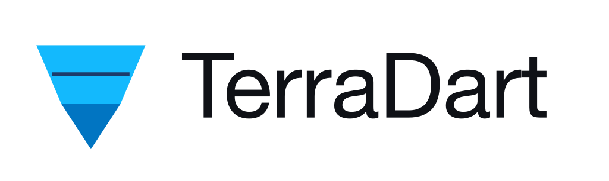

<p align="center">
  <picture>
    <source media="(prefers-color-scheme: dark)" srcset="branding/png/logo-horizontal-dark-1024.png">
    
  </picture>
</p>

# TerraDart

> **Type-safe IaC for Dart.**
>
> Google Cloud infrastructure as real Dart code — typed, refactor-safe, drop-in for `terraform apply`.

**Alpha** — no SemVer until v1.0.0, but breaking changes land only on **minor** bumps. Pin `^0.24.x`, read [`MIGRATING.md`](MIGRATING.md) before minor bumps, and see [status on terradart.dev](https://terradart.dev/docs/status/).

<!-- identity -->
[](https://pub.dev/packages/terradart_core)
[](https://pub.dev/packages/terradart_codegen)
[](https://pub.dev/packages/terradart_google)
[](https://pub.dev/packages/terradart_core/score)
[](https://dart.dev)
[](LICENSE)
<!-- health -->
[](https://github.com/nozomi-koborinai/terradart/actions/workflows/ci.yml)
[](https://github.com/nozomi-koborinai/terradart/actions/workflows/schema-bump.yml)

```dart
// infra/lib/app_infra.dart
// A Stack is one Terraform root module of GCP resources, written in Dart.
import 'package:terradart_core/terradart_core.dart';
import 'package:terradart_google/cloud_run.dart';
import 'package:terradart_google/cloud_sql.dart';
import 'package:terradart_google/iam.dart';
import 'package:terradart_google/provider.dart';

final class AppInfraStack extends Stack {
  AppInfraStack({required String projectId})
      : super(providers: [
          GoogleProvider(project: projectId, region: 'asia-northeast1'),
        ]) {
    add(GoogleSqlDatabaseInstance(
      localName: 'app_sql',
      name: TfArg.literal('app-sql'),
      databaseVersion: TfArg.literal(DatabaseVersion.postgres15),
      region: TfArg.literal('asia-northeast1'),
      settings: SqlDatabaseInstanceSettings(
        tier: TfArg.literal('db-f1-micro'),
      ),
    ));

    final runSa = add(GoogleServiceAccount(
      localName: 'run_sa',
      accountId: TfArg.literal('app-run-sa'),
    ));
    add(GoogleProjectIamMember(
      localName: 'run_sa_sql_client',
      project: TfArg.literal(projectId),
      role: TfArg.literal('roles/cloudsql.client'),
      member: TfArg.ref(runSa.iamMember),
    ));

    add(GoogleCloudRunV2Service(
      localName: 'app',
      name: TfArg.literal('app'),
      location: TfArg.literal('asia-northeast1'),
      template: CloudRunV2ServiceTemplate(
        serviceAccount: TfArg.ref(runSa.email),
        containers: [
          CloudRunV2ServiceServiceContainer(
            name: TfArg.literal('app'),
            image: TfArg.literal('gcr.io/cloudrun/hello'),
            ports: CloudRunV2ServiceContainerPort(
              containerPort: TfArg.literal(8080),
            ),
            env: [
              CloudRunV2ServiceEnvVar(
                name: TfArg.literal('DATABASE_URL'),
                source: CloudRunV2ServiceEnvVarFromLiteral(
                  TfArg.literal(
                    'postgresql://app-client@${projectId}.iam@localhost:5432/app',
                  ),
                ),
              ),
            ],
          ),
          CloudRunV2ServiceServiceContainer(
            name: TfArg.literal('cloud-sql-proxy'),
            image: TfArg.literal(
              'gcr.io/cloud-sql-connectors/cloud-sql-proxy:2.18.1',
            ),
            args: TfArg.literal([
              '--port=5432',
              '--auto-iam-authn',
              '${projectId}:asia-northeast1:app-sql',
            ]),
          ),
        ],
      ),
    ));
  }
}
```

Cloud SQL, IAM, and a multi-container Cloud Run service with a `cloud-sql-proxy` sidecar — the kind of stack you would otherwise maintain in HCL or the console. Per-service imports (`cloud_run.dart`, `cloud_sql.dart`, …) keep IDE completion scoped; the legacy `package:terradart_google/terradart_google.dart` barrel re-export remains supported.

More on [terradart.dev](https://terradart.dev/) and in [`examples/`](examples/).

## The boundary

**the boundary** = the place where infrastructure values (topic IDs, queue names, secret refs, IAM members) flow into runtime Dart code. Today that boundary is held together by string literals on both sides:

- A Pub/Sub topic name is hand-typed in HCL and again as a string literal in a Cloud Function.
- A renamed secret silently breaks runtime resolution because the reference is a string.
- IAM binding members drift between modules with no compiler visibility.

TerraDart makes this boundary a first-class artifact. The same `Topic` object whose ID is consumed by `terraform apply` is exported as a typed Dart constant your Firebase Function imports — and `dart analyze` catches drift the moment it happens.

```dart
// infra/lib/orders_stack.dart
import 'package:terradart_core/terradart_core.dart';
import 'package:terradart_google/provider.dart';
import 'package:terradart_google/pubsub.dart';

final class OrdersStack extends Stack {
  OrdersStack({required String projectId})
      : super(providers: [GoogleProvider(project: projectId)]) {
    final orders = GooglePubsubTopic(
      localName: 'orders',
      name: TfArg.literal('orders-prod'),
      messageRetentionDuration: TfArg.literal('604800s'),
    );
    add(orders);
    addExport('ORDERS_TOPIC', ResourceIdExport(orders.nameRef));
  }
}
```

```dart
// functions/lib/orders_handler.dart  (regenerated on synth)
import 'package:my_app_infra/exports.g.dart';

Future<void> handle(PubsubEvent event) async {
  if (event.topic == OrdersStackExports.ORDERS_TOPIC) {
    // ... process event
  }
}
```

Rename `orders-prod` in the Stack and the handler will not compile until the reference is fixed.

## Why TerraDart

A Dart team that wants to describe Google Cloud infrastructure has had three options up to now, none of which keep this boundary type-safe:

- **HCL** is mature and battle-tested, but the only way a Dart subscriber can read a topic ID is `terraform output | jq` and string parsing. The boundary is a string literal on both sides.
- **CDKTF** was the natural home for "infrastructure as real code" on top of Terraform. HashiCorp [archived CDKTF in December 2025](https://github.com/hashicorp/terraform-cdk); its TypeScript / Python / Java / Go targets never reached Dart, and the project's deprecation removes the long-term incentive for anyone to add it.
- **Pulumi** ships first-class TypeScript / Python / Go / Java / .NET SDKs, but no Dart SDK and no announced plans. Its state and provider-invocation model also diverge from the standard `terraform apply` pipeline most teams already run.

TerraDart deliberately occupies the Dart-shaped slot CDKTF did not reach and Pulumi did not pursue — synthesizing standard `*.tf.json` so your existing `terraform apply` pipeline runs unchanged.

## What you get

### Typed enums for every fixed-value field

```dart
GoogleStorageBucket(
  localName: 'assets',
  name: TfArg.literal('my-app-assets-prod'),
  storageClass: TfArg.literal(BucketStorageClass.standard),  // not 'STANDARD'
);
// BucketStorageClass.standerd ← typo: compile error
```

The `.terraformValue` getter convention encodes `BucketStorageClass.standard` as `"STANDARD"` at synth time. `ArgumentError` (not silent wrong JSON) on missing convention.

### Sealed types for exactly-one-of nested blocks

```dart
GoogleCloudRunV2Service(
  template: Template(
    containers: [ServiceContainer(
      image: TfArg.literal('gcr.io/cloudrun/hello'),
      env: [
        EnvVar(name: 'LOG_LEVEL',
               source: EnvVarFromLiteral(TfArg.literal('info'))),
        EnvVar(name: 'DB_PASSWORD',
               source: EnvVarFromSecret(secret: TfArg.literal('db-pwd'))),
      ],
    )],
  ),
);
```

`EnvVarSource` is a sealed type — the compiler keeps `env.value` and `env.value_source.secret_key_ref` mutually exclusive. Same pattern for BigQuery's 8-variant `Access`, Cloud Storage's `BucketObjectContent`, Cloud Run's `VolumeSource`.

### Plain Dart, not a templating DSL

`Stack` subclasses are regular Dart classes. Loops, conditionals, env config, dependency injection — all work the way they already work. There is no synth CLI; you call `stack.writeTo('tf-out')` from your own `bin/infra.dart` (or `stack.synth()` for an in-memory `SynthResult` without writing to disk).

## Quickstart

```yaml
# pubspec.yaml
dependencies:
  terradart_core: ^0.24.x
  terradart_google: ^0.24.x
```

```bash
dart pub get
dart run bin/infra.dart                                  # synth → tf-out/
cd tf-out && terraform init && terraform apply
```

Runnable end-to-end:  [`examples/pubsub_quickstart/`](examples/pubsub_quickstart/).

## terradart-mcp

**Alpha.** [`terradart-mcp`](packages/terradart_agent/) is an MCP server that exposes the curated factory **catalog** to coding agents (Claude Code, Cursor, Claude Desktop). Five read-only tools — `list_barrels`, `list_resources`, `get_resource_schema`, `get_quickstart`, and `check_coverage` — help agents author correct Dart without guessing factory names. It does **not** run Terraform or touch GCP.

```sh
brew install nozomi-koborinai/tap/terradart-mcp
# or download from GitHub releases — see packages/terradart_agent/README.md
```

Docs: [terradart.dev/docs/agent/](https://terradart.dev/docs/agent/)

## What ships

[`terradart_google`](packages/terradart_google/README.md) ships **452 curated resource factories + 1 data source** (453 catalog entries): AlloyDB (4 — cluster + instance + user + backup), API Keys (1 — key), App Engine (8 — application + URL dispatch + domain mapping + firewall rule + standard/flex versions + service network/traffic settings), Artifact Registry (4 — project config + repository + repository IAM member + download rule), Bigtable (10 — instance + table + app profile + GC policy + authorized/logical/materialized views + schema bundle + instance/table IAM members), Binary Authorization (3 — policy + attestor + attestor IAM member), Container Analysis (3 — note + note IAM member + occurrence), BigQuery (26 — standalone dataset access + dataset / table / dataset_iam_member / table_iam_member + job / routine / routine_iam_member / binding / policy / data_transfer_config / reservation / reservation group / capacity_commitment / connection + assignment / row access / data policy / datapolicy IAM + Analytics Hub exchange/listing/IAM/subscription + BI reservation + connection IAM), Chronicle (3 — custom list + native dashboard + dashboard chart), Certificate Manager (6 — DNS authorization / certificate / certificate map / map entry / trust config / issuance config), Private CA (5 — CA pool + pool IAM member + certificate authority + certificate + certificate template), Public CA (1 — ACME external account key), Cloud Build (4 — v2 SCM connection / v2 repository / trigger + worker pool), Config (1 — deployment), Cloud Deploy (6 — delivery pipeline / target / custom target type + their IAM members), Cloud Functions (2), Cloud Run v2 (6), Cloud Scheduler (1), Cloud SQL (5 — instance / database / user + SSL cert + source representation), Cloud Tasks (2), Contact Center Insights (8 — encryption spec + analysis rule + view + QA scorecard / revision / question + assessment rule + auto-labeling rule), Container / GKE (6 — cluster + node pool + fleet + membership + fleet scope + fleet namespace), GKE Backup (6 — plans + channels + plan IAM members), Apigee (2 — data collector + GCS datastore), App Hub (5 — application + boundary + service + service-project attachment + workload), Data Catalog (1 — entry group), Dataproc Metastore (4 — service + service IAM member + federation + federation IAM member), Dataplex (26 — data product + data-product data asset + IAM member + Universal Catalog entry group / entry type / entry / entry link / aspect type + metadata feed + business glossary / category / term + lake + zone + asset + asset IAM member + datascan + lake task + their IAM members), Dialogflow (2 — SIP trunk + agent), Sensitive Data Protection / DLP (4 — inspect template + de-identify template + stored info type + job trigger), Discovery Engine (5 — data store + search engine + IAM member / binding / policy), Compute (78 — including Cloud Router, Cloud NAT, VPC peering, classic + HA VPN gateways/tunnels, Shared VPC host/service attach, and the full L7 Application LB stack: forwarding rules + target proxies + URL maps + backend services + managed/self-managed SSL + MIG + Autoscaler + NEG + Cloud Armor + SSL Policy + health checks + SSL/TCP proxies + PSC + regional Armor/SSL + network endpoints + security policy rules + zonal disk / region disk / regional instant snapshot / snapshot IAM member / binding / policy + snapshot settings + static route + project metadata item + network firewall policy + regional network firewall policy / rule / IAM member + resource policy + disk resource policy attachment), DNS (6 — managed zone + zone IAM + policy + record set + response policy + rule), Eventarc (7 — trigger + channel + channel config + enrollment + API source + message bus + pipeline), Firebase App Check (8), Firebase App Hosting (5), Firebase Data Connect (1), Firebase Remote Config (1), Cloud Filestore (3 — instance + backup + snapshot), Firestore (5), IAM (7 — service accounts + project IAM + workload identity pool + provider), Identity Platform (2 — project config + tenant), IAP (8 — tunnel destination group + web backend service IAM binding + member + App Engine service / version / app IAM members + agent registry / location web IAM members), KMS (6), License Manager (1 — configuration), Migration Center (10 — settings + source + discovery client + import job + import data file + group + preference set + report config + report + assets export job), Logging (11 — metric + sinks + bucket / view / IAM / exclusion / saved query / log scope / linked dataset), Network (14 — NCC hub + CCI transport + ULL mirroring engine / collector / rule + address group + URL list + client/server TLS policies + gateway security policy + backend authentication config + connectivity test + VPC Flow Logs config + Network Services Mesh), OS Config (2 — OS policy assignment + patch deployment), Oracle Database@Google Cloud (11 — Autonomous Database + DB System + ODB network + subnet + GoldenGate deployment + connection + assignment + Exadata infrastructure + VM cluster + ExaDB VM cluster + Exascale storage vault), Monitoring (10 — alert policy + notification channel + uptime check + dashboard + metric descriptor / service + SLO / group / custom service / monitored project), project service enablement (1), Pub/Sub (6 — topic / subscription / 2 iam_member + schema + schema_iam_member), Security Command Center (1 — v2 project notification config), reCAPTCHA Enterprise (1 — key), Memorystore Memcached (1 — instance), Memorystore Redis (1 — instance), Cloud Spanner (2 — instance + database), Secret Manager (6 — secret / version / secret IAM member + regional secret / regional version / regional secret IAM member), Service Networking (2 — connection + VPC access connector), Cloud Storage (7 — bucket / bucket_object / bucket_iam_member / bucket_iam_binding + notification + hmac_key + managed folder), Resource Manager Tags (5 — tag key / tag value / tag binding + tag key/value IAM member), Workflows (1 — workflow), Service Directory (5 — namespace / service / endpoint + namespace/service IAM member), Essential Contacts (1 — contact), Document AI (1 — processor), Cloud Healthcare (11 — dataset / DICOM store / consent store / HL7v2 store / FHIR store / Data Mapper workspace + dataset / DICOM / HL7v2 / consent / FHIR IAM members), Cloud Observability (1 — trace scope), Parameter Manager (4 — parameter / version / regional parameter / regional version), BigLake Metastore (6 — catalog / database / table + iceberg catalog / namespace / table), Colab Enterprise (3 — runtime template + template IAM + schedule), Cloud Source Repositories (2 — repository + repository IAM member), Vertex AI Workbench / Notebooks (1 — environment), Vertex AI (7 — feature group + managed dataset + Tensorboard + experiment + run + schedule + cache config), Gemini for Google Cloud (4 — enablement / logging / release channel / data-sharing-with-Google settings), and the `google_project` data source. CI verifies regeneration is byte-deterministic via `terradart wrap --check`.


For any other `google_*` resource: open a [feature request](https://github.com/nozomi-koborinai/terradart/issues/new/choose) to discuss adding it to the curated surface.

## Examples

Foundational

- [Pub/Sub topic + IAM member](examples/pubsub_quickstart/)
- [Security Command Center v2 project notification config](examples/scc_notification_quickstart/)
- [Cloud Tasks queue + IAM member](examples/cloud_tasks_quickstart/)
- [Secret Manager (write-only fields)](examples/secret_manager_quickstart/)
- [Cloud Scheduler → Pub/Sub target](examples/cloud_scheduler_quickstart/)
- [Apigee data collector + analytics datastore](examples/apigee_quickstart/)
- [IAM members across Pub/Sub, Tasks, Secret Manager, and IAP (App Engine, Agent Registry, location web)](examples/iam_quickstart/)
- [IAP tunnel destination group](examples/iap_tunnel_quickstart/)
- [Identity Platform tenant](examples/identity_platform_quickstart/)
- [Container Analysis note](examples/container_analysis_quickstart/)
- [App Hub application](examples/apphub_quickstart/)

Compute & networking

- [Compute network + external address (typed enums)](examples/compute_quickstart/) — extended with bulk per-instance MIG config, global + regional network firewall policy (rule + IAM member), and zonal VM extension policy
- [GKE cluster + node pool + Hub fleet membership](examples/gke_quickstart/)
- [DNS managed zone (private + DNSSEC)](examples/dns_quickstart/)

Data & storage

- [GCS bucket + bucket object](examples/storage_quickstart/)
- [BigQuery dataset (sealed `Access` hierarchy)](examples/bigquery_quickstart/)
- [Cloud Bigtable instance + table + views + IAM](examples/bigtable_quickstart/)
- [Data Catalog entry group](examples/data_catalog_quickstart/)
- [Dataplex data product + IAM member](examples/dataplex_quickstart/)
- [Vertex AI Search data store + engine + IAM](examples/discovery_engine_quickstart/)
- [Cloud KMS project Autokey config](examples/kms_autokey_quickstart/)
- [Cloud KMS keyring + crypto key](examples/kms_quickstart/)
- [License Manager Office SPLA configuration](examples/license_manager_quickstart/)
- [Migration Center sources, discovery, import, groups, and reports](examples/migration_center_quickstart/)
- [Dataproc Metastore service and federation](examples/dataproc_metastore_quickstart/)
- [Filestore High Scale SSD snapshot](examples/filestore_quickstart/)
- [Artifact Registry project config + Docker repo + download rule](examples/artifact_registry_quickstart/)

Application platform & operations

- [Cloud Run v2 service (sealed `EnvVarSource`)](examples/cloud_run_quickstart/)
- [Access Context Manager policy + perimeter](examples/access_context_quickstart/)
- [OS Config + Binary Authorization VM compliance](examples/vm_compliance_quickstart/)
- [API Keys + reCAPTCHA Enterprise + connectivity test](examples/api_security_quickstart/)
- [Logging sinks (project / folder / org) → BigQuery](examples/ops_quickstart/)
- [Monitoring alert policy with typed `Aligner` / `Reducer`](examples/monitoring_quickstart/)
- [Infrastructure Manager Git blueprint deployment](examples/config_deployment_quickstart/)
- [Dialogflow CX SIP trunk](examples/dialogflow_quickstart/)
- [Network Connectivity CCI transport](examples/network_connectivity_quickstart/)
- [Network Security ULL mirroring](examples/network_security_ull_quickstart/)
- [Oracle GoldenGate deployment and connections](examples/oracle_goldengate_quickstart/)
- [Oracle Autonomous Database on ODB networking](examples/oracle_autonomous_database_quickstart/)
- [Oracle Base Database DB System](examples/oracle_db_system_quickstart/)
- [Oracle Exadata and ExaDB](examples/oracle_exadata_quickstart/)
- [Chronicle custom list](examples/chronicle_quickstart/)
- [Eventarc message bus + pipeline + Pub/Sub trigger](examples/eventarc_quickstart/)
- [Resource Manager tags (key + value + binding + IAM)](examples/tags_quickstart/)
- [Service Directory namespace + service + endpoint + IAM](examples/service_directory_quickstart/)
- [Workflows workflow from inline YAML](examples/workflows_quickstart/)
- [App Engine application + standard/flex versions + routing](examples/app_engine_quickstart/)
- [Compute static route + project metadata item](examples/compute_route_quickstart/)
- [Compute project snapshot settings](examples/compute_snapshot_settings_quickstart/)
- [Document AI OCR processor](examples/document_ai_quickstart/)
- [Parameter Manager global + regional parameters](examples/parameter_manager_quickstart/)
- [Network Security address group + URL list](examples/network_security_lists_quickstart/)
- [Network Security client + server TLS policies](examples/network_security_tls_quickstart/)
- [Network Security gateway security policy](examples/network_security_gateway_policy_quickstart/)
- [Network Security backend authentication config](examples/network_security_backend_auth_quickstart/)
- [Network Management VPC Flow Logs config](examples/network_management_vpc_flow_logs_quickstart/)
- [Public CA ACME external account key](examples/public_ca_quickstart/)
- [Network Services Mesh](examples/network_services_mesh_quickstart/)
- [Cloud Healthcare dataset + DICOM/consent/HL7v2/FHIR stores](examples/healthcare_quickstart/)
- [Contact Center AI Insights analysis rule + view + QA scorecard/revision/question + assessment + auto-labeling](examples/contact_center_insights_quickstart/)
- [Colab Enterprise runtime template + template IAM + paused schedule](examples/colab_quickstart/)
- [Cloud Source Repositories repo + IAM](examples/sourcerepo_quickstart/)
- [Vertex AI Workbench environment (container image)](examples/notebooks_quickstart/)
- [Sensitive Data Protection (DLP) inspect / de-identify templates + stored info type + paused job trigger](examples/dlp_quickstart/)
- [Cloud Observability trace scope](examples/observability_quickstart/)
- [GKE Hub fleet scope, namespace, and rollout sequence (no cluster)](examples/gke_hub_quickstart/)

## How it compares

|   | TerraDart | HCL | CDKTF | Pulumi |
|---|---|---|---|---|
| Dart authoring | ✅ | ❌ | ❌ (TS / Py / Java / Go) | ❌ (TS / Py / Go / etc.) |
| Type-safe handoff to your app | ✅ (compile-time) | ❌ (`terraform output` + parse) | ❌ (no Dart) | ❌ (no Dart) |
| Drop-in for `terraform apply` | ✅ (emits `*.tf.json`) | ✅ (native) | ✅ | ⚠️ (different state model) |
| Project status | Alpha | Mature | **Archived Dec 2025** | Active |

## Non-goals

- **Not a Terraform replacement.** TerraDart synthesizes JSON; `terraform plan / apply` runs as before. State stays where you already keep it.
- **Not a multi-cloud tool yet.** Google provider only. AWS / Azure may follow if the curated surface stabilizes — no promise.
- **Not a constructs framework.** Composite abstractions are out of scope for the pre-1.0 cycle.
- **Not module-block support.** Compose Terraform modules in HCL alongside TerraDart-generated `*.tf.json` — both feed the same `terraform apply`.

## Status

**Alpha**, pre-1.0 (0.24.x). No SemVer until v1.0.0, but breaking changes land only on **minor** bumps, always documented in [`MIGRATING.md`](MIGRATING.md); pin `^0.24.x` and take patches freely. Beta needs external validation — see the [path to beta](https://terradart.dev/docs/status/#path-to-beta). Expectations: [terradart.dev/docs/status/](https://terradart.dev/docs/status/).

## Schema-bump automation (Plan 5.E)

A weekly GitHub Actions workflow (`.github/workflows/schema-bump.yml`)
auto-detects new `terraform-provider-google` v7 minor/patch releases and
upstream `magic-modules` MM YAML overlay updates. Each Monday morning JST
the workflow opens a PR titled `chore(schema): weekly bump YYYY-MM-DD`
whose body is a structured drift report. When the workflow finds nothing
to report, no PR is created.

**Weekly maintenance flow:**

1. PR appears (or not — silence means clean week).
2. Read the drift report's Summary table. If everything is ✅, squash-merge.
3. Wrappers (and barrels) are regenerated by the workflow and included in
   the PR — the `wrap --check` row confirms the committed result. If the
   regenerate step failed, fix `wrapper_overrides/yaml/*.yaml` locally,
   re-run `terradart wrap`, and push to the bump branch.
4. For new resources: review the appended `tool/curation_backlog.yaml`
   entries and decide whether to queue them for a future Wave.
5. For a `⚠️ NEW MAJOR AVAILABLE: v8.x` banner: do not bump in the same PR —
   plan a separate v8 migration effort (curated-surface regression sweep).

**Ad-hoc trigger:** workflow_dispatch on the Actions tab (with `dry_run`
input for detection-only runs).

**Repo secret:** `SCHEMA_BUMP_PAT` — a fine-grained PAT with **Contents**
and **Pull requests** write access. The default `GITHUB_TOKEN` can push the
bump branch but cannot open the PR when the repository blocks Actions from
creating pull requests.

**Why not Renovate for terraform-provider-google?** Renovate has no
auto-detection path with our repo shape (no `.tf` or `.terraform-version`
file). The schema-bump workflow is the single source of truth for provider
bump tracking. Dart toolchain bumps still use Renovate as configured in
`renovate.json`.

## Contributing

See [CONTRIBUTING.md](CONTRIBUTING.md). For security issues, use the [GitHub private security advisory flow](SECURITY.md).

## Trademarks

"Terraform" is a registered trademark of HashiCorp, Inc.

Dart™ and the related logo are trademarks of Google LLC. We are not endorsed by or affiliated with Google LLC.

TerraDart is an independent open-source project and is not affiliated with, endorsed by, or sponsored by HashiCorp or Google.

## License & acknowledgements

Apache-2.0. See [LICENSE](LICENSE).

The framing draws on prior work in [CDKTF](https://github.com/hashicorp/terraform-cdk) (archived Dec 2025), [AWS CDK](https://aws.amazon.com/cdk/), and [Pulumi](https://www.pulumi.com/).
