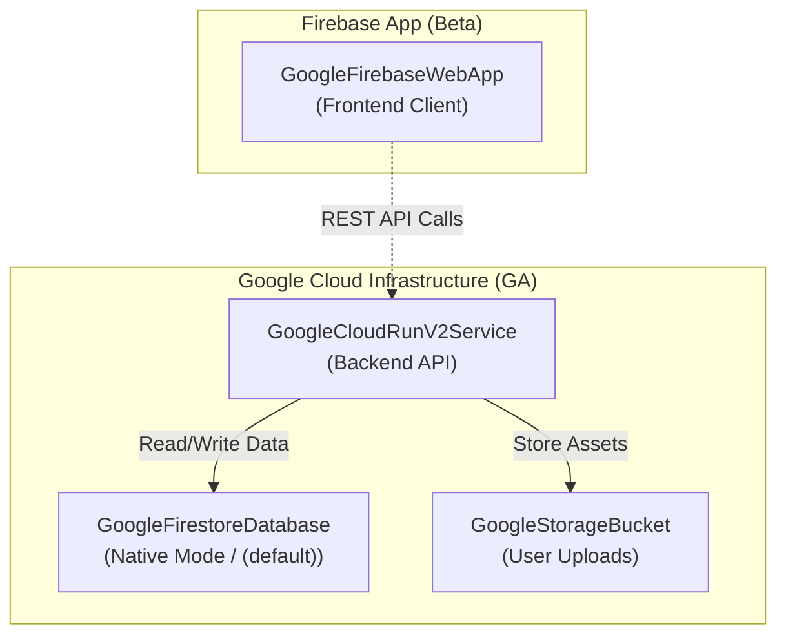

# firebase-app-backend

> Part of the [TerraDart cookbook](../README.md). Library: [terradart](https://github.com/nozomi-koborinai/terradart).

A full-stack recipe demonstrating how to combine **Firebase (beta)** and **Google Cloud (GA)** resources in a single TerraDart `Stack`.

## Pattern demonstrated

Many modern Dart & Flutter applications leverage Firebase for client-facing app integration (Firebase Web/Mobile Apps, Auth, Hosting) alongside Google Cloud infrastructure for the backend datastore and containerized microservices.

In Terraform, Firebase resources are provided by `hashicorp/google-beta`, while core Google Cloud resources reside in `hashicorp/google`. TerraDart enables you to compose both in one typed `Stack` without manual provider block gymnastics.

### Architecture



## Resources included

- **Google Cloud APIs (GA)**: `firebase`, `firestore`, `run`, `storage` enabled via `GoogleProjectService`.
- **Firebase Initialization (Beta)**:
  - `GoogleFirebaseProject` — Activates Firebase services on the Google Cloud project.
  - `GoogleFirebaseWebApp` — Registers a frontend Web App client with Firebase.
- **Backend & Datastore (GA)**:
  - `GoogleFirestoreDatabase` — Native mode `(default)` Firestore database.
  - `GoogleStorageBucket` — Cloud Storage bucket with uniform bucket-level access.
  - `GoogleCloudRunV2Service` — Containerized backend service injecting the upload bucket name into container environment variables.

## Prerequisites

- Dart SDK ≥ 3.6
- Terraform CLI ≥ 1.11.0
- Google Cloud project with Application Default Credentials configured (`gcloud auth application-default login`)

## Run

```bash
export GCP_PROJECT_ID=my-project-id

dart pub get
dart run bin/infra.dart        # → tf-out/main.tf.json

cd tf-out
terraform init
terraform plan
terraform apply
```

To clean up resources:

```bash
terraform destroy
```

## How provider composition works

1. **Both Providers in `Stack.providers`**:
   ```dart
   providers: [
     GoogleProvider(project: projectId, region: 'asia-northeast1'),
     GoogleBetaProvider(project: projectId, region: 'asia-northeast1'),
   ]
   ```
2. **Automatic Provider Routing**:
   Wrappers in `terradart_google_beta` automatically set `provider = "google-beta"` in the synthesized Terraform JSON, so resources are cleanly partitioned between the GA and Beta provider instances.
