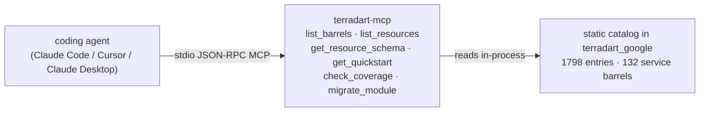

`terradart-mcp` is a [Model Context Protocol](https://modelcontextprotocol.io) (MCP) server that exposes TerraDart's curated Google Cloud factory **catalog** to coding agents. The catalog covers 1798 entries (1337 curated resource factories + 461 data sources) across 132 service barrels (`agent`, `compute`, `container`, `pubsub`, `cloud_run`, `alloydb`, `redis`, `iap`, `firestore`, and more). With the server connected, an agent can look up the exact constructor signatures, nested types, and ready-made `Stack` templates it needs to author correct TerraDart Dart code — instead of guessing factory names from memory.

It also carries the migrator: `migrate_module` takes a Terraform module's own text and hands back the `Stack` it becomes, so an agent looking at an existing `.tf` file can answer "what does this look like in TerraDart?" from the same connection.

It is built with [genkit_mcp](https://pub.dev/packages/genkit_mcp) (Genkit's MCP server library) and ships as a single compiled binary. Coding agents connect via Claude Code, Claude Desktop, or Cursor; a Genkit Dart app can host the server as an MCP client too ([Connecting clients](/docs/agent/clients/#genkit-dart)).

## How it fits together

The agent speaks JSON-RPC over stdio. `terradart-mcp` answers each tool call by reading the catalog that is compiled into `terradart_google` — no separate data files, no network round-trips.

## What it does NOT do

Every tool answers from what the caller passed and what is compiled into the binary. `terradart-mcp` does **not**:

- run `terraform` (no `plan`, no `apply`);
- touch Google Cloud, your project, or any credentials;
- read or write any file on your machine — `migrate_module` takes the module as text in the call and returns the generated Dart as text in the result, and writes nothing anywhere;
- synthesize or apply infrastructure;
- need network access to do its job.

If an agent wants to actually synthesize and apply a stack, that still happens the normal way — see [How it works](/docs/how-it-works/). `terradart-mcp` exists purely so the agent writes the right Dart in the first place.

## Next steps

- [Install](/docs/agent/install/) — Homebrew or a direct binary download.
- [Connecting clients](/docs/agent/clients/) — Claude Code, Claude Desktop, Cursor, and Genkit Dart.
- [Tools reference](/docs/agent/tools-reference/) — the 6 tools, with request/response examples.
- [Recipes](/docs/agent/recipes/) — prompt patterns for discovery, schema lookup, scaffolding, and plan review.
