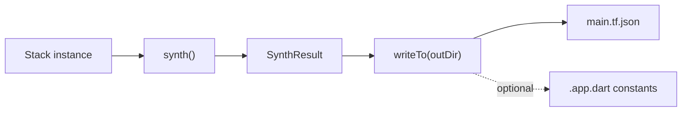
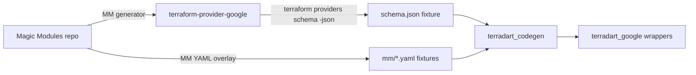
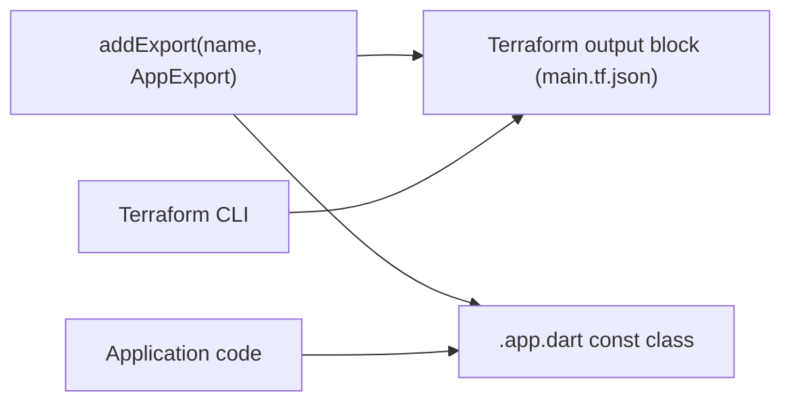

import Pipeline from "../../../components/Pipeline.astro";

TerraDart is a thin authoring layer that produces standard Terraform JSON. The Dart side gives you types, refactor, and `dart analyze`; the Terraform side keeps state, planning, and apply unchanged.

<Pipeline
  eyebrow="Pipeline"
  heading="From Dart to terraform apply"
  steps={[
    {
      title: "Author",
      body: "Write <code>final class XxxStack extends Stack</code> using curated factories from provider packages.",
    },
    {
      title: "Generate Terraform JSON",
      body: "Call <code>stack.writeTo('tf-out')</code> to emit <code>*.tf.json</code>, or <code>stack.synth()</code> first if you need the in-memory <code>SynthResult</code>.",
    },
    {
      title: "Apply",
      body: "Run <code>terraform plan</code> and <code>terraform apply</code> against your existing state backend.",
    },
    {
      title: "Hand off (optional)",
      body: "Surface <code>AppExport</code> values as typed Dart constants and Terraform outputs for downstream apps.",
    },
  ]}
/>

## What is synth?

On the [landing page](/), we say you **generate** `*.tf.json` — plain language for the outcome.

In the API, **synth** is the in-memory step: your `Stack` is walked and assembled into the Terraform JSON tree. Code: `stack.synth()` → `SynthResult`. Writing files is the next step: `stack.writeTo(outDir)`.

## Stack lifecycle (`synth()` internals)



`synth()` is the pure, in-memory step. It walks the resources you registered with `add(...)`, applies lifecycle wiring, dedups, and produces a `SynthResult` whose `tfJson` field carries the Terraform JSON tree.

`writeTo(outDir)` is the file-I/O wrapper. It always writes `main.tf.json`. If you registered `AppExport`s via `addExport(...)` AND called `setAppExportsOutputPath(...)`, it also writes a generated `.app.dart` file with typed Dart constants. If you registered exports but forgot to set the output path, `writeTo` throws `StateError` *before* writing anything — the failure mode is atomic, never partial.

`Stack`, `Resource`, and `Data` are `abstract base class`. Your subclasses must declare a class modifier:

```dart
final class AppInfraStack extends Stack { /* ... */ }
```

`base` and `sealed` are also valid; what is rejected is plain `class` (or `implements Stack`, which would bypass the base-class state that synth depends on).

## Provider integration

TerraDart supports multiple official Terraform providers with curated, typed Dart factories:

- **[`terradart_google`](https://pub.dev/packages/terradart_google)** — **GA** HashiCorp [`google`](https://registry.terraform.io/providers/hashicorp/google/latest) provider catalog. See [status](/docs/status/) and the [package README](https://pub.dev/packages/terradart_google) for counts; the full list is on [Coverage](/docs/coverage/).
- **[`terradart_google_beta`](https://pub.dev/packages/terradart_google_beta)** — **beta-only** types from `hashicorp/google-beta` (128 resource factories at the current pin).
- **[`terradart_appwrite`](https://pub.dev/packages/terradart_appwrite)** — official `appwrite/appwrite` provider resources.
- **[`terradart_cloudflare`](https://pub.dev/packages/terradart_cloudflare)** — official `cloudflare/cloudflare` provider resources.

For the Google provider, TerraDart depends on upstream sources reconciled automatically on a weekly cadence:



The MM YAML overlay carries metadata that the provider schema does not surface — `sensitive_fields`, `force_new`, free-form description text. `terradart_codegen` merges inputs into typed `<resource>.schema.dart` files that compose into the `terradart_google` package.

Provider tracking for Google is pinned to GA `~> 7.0`. Beta-only types live in `terradart_google_beta` (128 resource factories at the current pin); overlapping GA names stay in `terradart_google`.

A weekly GitHub Actions workflow (`.github/workflows/schema-bump.yml`) runs every Monday morning JST. It detects new `terraform-provider-google` v7 releases and MM YAML overlay changes, refreshes the local schema + MM fixtures, runs `terradart wrap --check`, and opens a single drift-report PR if anything needs maintainer attention. Quiet weeks produce no PR.

You don't need to track this loop to use TerraDart. The reason it's documented here is so that, when a v0.x.x release adds new curated factories or shifts an existing one, you can see exactly which upstream change drove it.

## AppExport: the IaC ↔ application seam

`AppExport` is the typed handoff from your Stack to whatever Dart application code consumes the resources it provisions (for example Cloud Run functions handlers).



Two export kinds cover most cases:

- **`ResourceIdExport`** — for values that aren't known until apply time, like a Cloud Run service URL. Pass `emitTerraformOutput: true` and Terraform writes the resolved value into its output. Application code can fetch it via `terraform output -raw <name>`.
- **`StringExport`** — for literals known at synth time (service name, region, project ID). These materialize as `static const` declarations on the generated `<StackName>Exports` class in your `.app.dart` file — `dart analyze` catches rename drift before you ever `terraform apply`.

Calling `setAppExportsOutputPath(...)` is what triggers the `.app.dart` emission. Exports whose values are only known after apply (for example `ResourceIdExport(topic.id)`) emit Terraform `output` blocks only; literal-resolvable exports (for example `ResourceIdExport(topic.nameRef)`) become typed Dart constants. Runnable pattern: [pubsub quickstart](https://github.com/nozomi-koborinai/terradart/tree/main/examples/pubsub_quickstart) (`lib/subscriber_stub.dart`).

A worked end-to-end example lives in the [cookbook `single-project-app` recipe](https://github.com/nozomi-koborinai/terradart/tree/main/cookbook/single-project-app), exporting `coffee_service_uri` (Terraform output), `SERVICE_NAME`, and `REGION` (Dart constants).

## Non-goals

- Not a Terraform replacement — state and apply stay in Terraform.
- Not a multi-cloud abstraction layer — wrappers faithfully mirror provider schemas rather than imposing cross-cloud abstractions.
- Not a constructs framework in the pre-1.0 cycle.
- Not module-block support — compose Terraform modules in HCL alongside TerraDart-generated `*.tf.json`; both feed the same `terraform apply`.

See [README — Non-goals](https://github.com/nozomi-koborinai/terradart#non-goals) for the canonical list.

## Further reading

- [How it's built](/docs/how-its-built/) — the generation pipeline and verification harness behind these factories.
- [`terradart_core` on pub.dev](https://pub.dev/packages/terradart_core) — Stack / TfArg / AppExport API reference.
- [`terradart_google` on pub.dev](https://pub.dev/packages/terradart_google) — the curated Google factory catalog.
- [`terradart_appwrite` on pub.dev](https://pub.dev/packages/terradart_appwrite) — curated Appwrite factories.
- [`terradart_cloudflare` on pub.dev](https://pub.dev/packages/terradart_cloudflare) — curated Cloudflare factories.
- [`terradart_codegen` on pub.dev](https://pub.dev/packages/terradart_codegen) — `wrap` / `codegen` CLI reference.
- [`examples/` on GitHub](https://github.com/nozomi-koborinai/terradart/tree/main/examples) — runnable quickstart Stacks.
