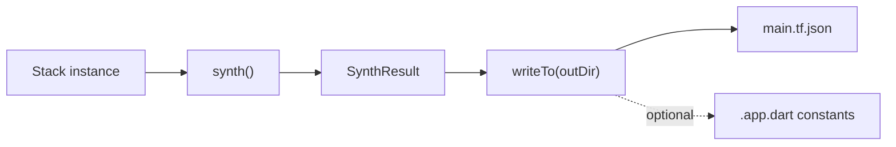
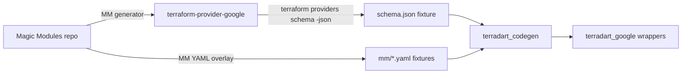
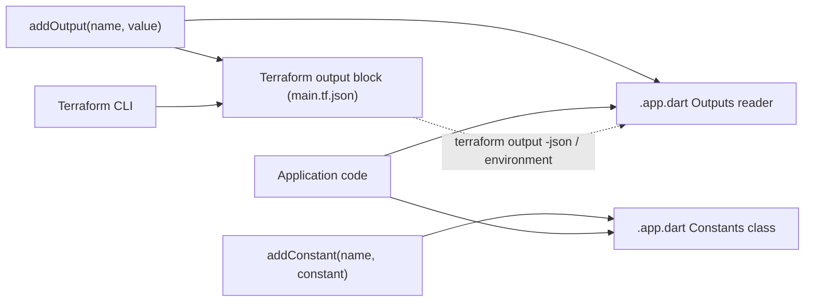

import Pipeline from "../../../components/Pipeline.astro";

TerraDart is a thin authoring layer that produces standard Terraform JSON. The Dart side gives you types, refactor, and `dart analyze`; the Terraform side keeps state, planning, and apply unchanged.

<Pipeline
  eyebrow="Pipeline"
  heading="From Dart to terraform apply"
  steps={[
    {
      title: "Author",
      body: "Write <code>final class XxxStack extends Stack</code> using curated factories from provider packages.",
    },
    {
      title: "Generate Terraform JSON",
      body: "Call <code>stack.writeTo('tf-out')</code> to emit <code>*.tf.json</code>, or <code>stack.synth()</code> first if you need the in-memory <code>SynthResult</code>.",
    },
    {
      title: "Apply",
      body: "Run <code>terraform plan</code> and <code>terraform apply</code> against your existing state backend.",
    },
    {
      title: "Hand off (optional)",
      body: "Hand values to downstream apps as typed Dart constants (<code>addConstant</code>) and Terraform outputs (<code>addOutput</code>).",
    },
  ]}
/>

## What is synth?

On the [landing page](/), we say you **generate** `*.tf.json` — plain language for the outcome.

In the API, **synth** is the in-memory step: your `Stack` is walked and assembled into the Terraform JSON tree. Code: `stack.synth()` → `SynthResult`. Writing files is the next step: `stack.writeTo(outDir)`.

## Stack lifecycle (`synth()` internals)


```mermaid
graph LR
  S[Stack instance] --> SY["synth()"]
  SY --> SR[SynthResult]
  SR --> W["writeTo(outDir)"]
  W --> TF[main.tf.json]
  W -.optional.-> AD[".app.dart constants"]
```

`synth()` is the pure, in-memory step. It walks the resources you registered with `add(...)`, applies lifecycle wiring, dedups, and produces a `SynthResult` whose `tfJson` field carries the Terraform JSON tree.

`writeTo(outDir)` is the file-I/O wrapper. It always writes `main.tf.json`. When the Stack was constructed with `appExports: AppExports('lib/generated/<stack>.app.dart')`, it also writes that generated Dart file, rewritten in full on every synth. Synth runs before any write, so a Stack that cannot synthesize throws with nothing written — the failure mode is atomic, never partial.

### Synth issues

Before it encodes anything, synth checks the whole Stack and collects every problem it finds into one `SynthException`, so a broken Stack reports all of its issues in one run instead of one per fix. Each problem is a subtype of the sealed `SynthIssue`, carrying the address of the block that holds it and a message that says how to fix it:

| Issue | When |
|-------|------|
| `NoProviders` / `MissingProvider` / `ProviderConflict` | no provider is registered, a block needs one that is not, or two registrations clash (a repeated alias, different version pins for one name) |
| `UndeclaredVariable` | a `.variable('x')` or `var.x` names a variable neither `addVariable` nor `addExternalVariable` declared |
| `UnregisteredReference` | a block reads (or `depends_on`) a resource, data source or module that was built but never passed to `add` / `addModule` |
| `SensitiveLiteral` | a sensitive field is set to a literal, which would write the secret into `main.tf.json` |
| `InvalidTimeout` | a `TfTimeouts` value is not a Go duration string |
| `InvalidMoveTarget` | an `addMoved` target names no resource of the Stack |
| `UnresolvableConstant` | an `addConstant(...)` attribute has no literal value at synth |

`stack.validate()` returns the same list without throwing — the shape a test or a pre-commit check wants. The sealed hierarchy lets a `switch` handle the issues it cares about:

```dart
// lib/explain_stack.dart
import 'package:terradart_core/terradart_core.dart';

/// Prints why [stack] cannot synthesize, or nothing when it can.
void explain(Stack stack) {
  for (final issue in stack.validate()) {
    switch (issue) {
      case UnregisteredReference(:final address, :final target):
        print('$address reads $target, which was never added');
      case SensitiveLiteral(:final address, :final field):
        print('$address would write the secret $field into main.tf.json');
      default:
        print(issue);
    }
  }
}
```

A block declared in a hand-written `.tf` file beside `main.tf.json` is the one legitimate unregistered reference: declare it with `addExternalBlock('google_pubsub_topic.legacy')`, the counterpart of `addExternalVariable` for variables (`terradart-migrate` does this for the blocks it leaves in the sidecar). Names are checked earlier, where they are registered: `add`, `addModule`, `addVariable` and `addOutput` throw `ArgumentError` for a name that is not a Terraform identifier.

`Stack`, `Resource`, and `Data` are `abstract base class`. Your subclasses must declare a class modifier:

```dart
final class AppInfraStack extends Stack {
  AppInfraStack() : super(providers: [GoogleProvider(project: 'my-project')]);
}
```

`base` and `sealed` are also valid; what is rejected is plain `class` (or `implements Stack`, which would bypass the base-class state that synth depends on).

## Provider integration

TerraDart supports multiple official Terraform providers with curated, typed Dart factories:

- **[`terradart_google`](https://pub.dev/packages/terradart_google)** — **GA** HashiCorp [`google`](https://registry.terraform.io/providers/hashicorp/google/latest) provider catalog. See [status](/docs/status/) and the [package README](https://pub.dev/packages/terradart_google) for counts; the full list is on [Google Cloud coverage](/docs/coverage/google/).
- **[`terradart_google_beta`](https://pub.dev/packages/terradart_google_beta)** — **beta-only** types from `hashicorp/google-beta` (112 resource factories at the current pin).
- **[`terradart_appwrite`](https://pub.dev/packages/terradart_appwrite)** — official `appwrite/appwrite` provider resources (filled at the current pin).
- **[`terradart_cloudflare`](https://pub.dev/packages/terradart_cloudflare)** — official `cloudflare/cloudflare` provider resources (filled at the current pin; nested plugin-framework objects are typed Dart helpers).
- **[`terradart_aws`](https://pub.dev/packages/terradart_aws)** — HashiCorp [`aws`](https://registry.terraform.io/providers/hashicorp/aws/latest) provider resources (filled at the current pin).

Each has a page under Providers: [Google Cloud](/docs/providers/google/), [AWS](/docs/providers/aws/), [Cloudflare](/docs/providers/cloudflare/), [Appwrite](/docs/providers/appwrite/).

**[`terradart_time`](https://pub.dev/packages/terradart_time)** is a hand-written utility package beside them: `TimeProvider` / `TimeSleep` for HashiCorp [`time`](https://registry.terraform.io/providers/hashicorp/time/latest), usable from a stack on any of the provider packages.

For the Google provider, TerraDart depends on upstream sources reconciled automatically on a weekly cadence:


```mermaid
graph LR
  MM[Magic Modules repo]
  MM -->|MM generator| TPG[terraform-provider-google]
  MM -->|MM YAML overlay| MMY["mm/*.yaml fixtures"]
  TPG -->|"terraform providers schema -json"| SJ[schema.json fixture]
  SJ --> CG[terradart_codegen]
  MMY --> CG
  CG --> WR["terradart_google wrappers"]
```

The MM YAML overlay carries metadata that the provider schema does not surface — `sensitive_fields`, `force_new`, free-form description text. `terradart_codegen` merges inputs into typed `<resource>.schema.dart` files that compose into the `terradart_google` package.

Provider tracking for Google is pinned to GA `~> 8.0`. Beta-only types live in `terradart_google_beta` (112 resource factories at the current pin); overlapping GA names stay in `terradart_google`.

A weekly GitHub Actions workflow (`.github/workflows/schema-bump.yml`) bumps each provider in its own job and PR: Google (with the google-beta ride-along) Sunday 22:00 UTC, AWS on Monday, Cloudflare on Tuesday. Each job detects the latest release in the provider's tracked major (Google v8 plus its MM YAML overlay changes, AWS v6, Cloudflare v5), refreshes the local schema fixture, regenerates the wrappers, and opens a drift-report PR. New upstream resources and data sources ship straight away as factories generated from a default override, queued for API polish and an example. A routine Google or AWS bump — no removed resources and no breaking change to the generated Dart API — auto-merges once CI is green; Cloudflare bumps and anything else wait for the maintainer. Quiet weeks produce no PR.

You don't need to track this loop to use TerraDart. The reason it's documented here is so that, when a v0.x.x release adds new curated factories or shifts an existing one, you can see exactly which upstream change drove it.

## Outputs and constants: the IaC ↔ application seam

A Stack hands values to the Dart application code that uses its resources (for example a Cloud Run service) in two ways, each with its own method:


```mermaid
graph LR
  AO["addOutput(name, value)"] --> TFO["Terraform output block (main.tf.json)"]
  AO --> RD[".app.dart Outputs reader"]
  AC["addConstant(name, constant)"] --> DC[".app.dart Constants class"]
  ST[Application code] --> DC
  ST --> RD
  TF[Terraform CLI] --> TFO
  TFO -.terraform output -json / environment.-> RD
```

- **`addOutput`** declares a Terraform `output` for a value known after apply — a resource ID, a Cloud Run URL — and a getter of the generated reader (see below). It takes any `TfArg`, so the value is a dot shorthand like every resource argument: `addOutput('service_url', service.uri, description: 'Cloud Run URL')`. It checks at registration that the name is a Terraform identifier, is not taken, and — unless `sensitive: true` — that the value does not read a sensitive field. Read it with `terraform output -raw service_url`.
- **`addConstant`** declares a `static const` on the generated `<StackName>Constants` class, for a value known at synth. The value is a sealed `AppConstant<T>`, picked with a dot shorthand:
  - `topic.name` — the literal an attribute of the Stack is set to (`name: .literal('orders-prod')`), so the string is written once. Every input has such a getter, named `<input>Ref` (`scope.scopeId` for `scope_id`), and other resources can take it too (`scopeId: scope.scopeId`). Synth reports an `UnresolvableConstant` issue that says what the attribute is set by when it is not a literal (a reference, a variable, an expression, or left for the provider to compute) or is a sensitive field.
  - `.value(5)` — a value that belongs to no resource, such as an API version.
  - `.fromEnvironment('API_BASE_URL')` — a `String.fromEnvironment` read at the app's compile time.

  `T` can be `String`, `int`, `double`, `num`, `bool`, `Object`, or a `List` / `String`-keyed `Map` of them, each optionally nullable; `addConstant` rejects any other type, a name that is not a public Dart identifier, and a duplicate.

The constants file is configured once, on the constructor, and `addConstant` throws when it is missing:

```dart
// lib/orders_stack.dart
import 'package:terradart_core/terradart_core.dart';
import 'package:terradart_google/provider.dart';
import 'package:terradart_google/pubsub.dart';

final class OrdersStack extends Stack {
  OrdersStack({required String projectId})
    : super(
        providers: [GoogleProvider(project: projectId)],
        appExports: AppExports('lib/generated/orders_stack.app.dart'),
      ) {
    final topic = add(GooglePubsubTopic(localName: 'orders', name: .literal('orders-prod')));
    addConstant('ordersTopicName', .ref(topic.name));
    addOutput('orders_topic_id', topic.id);
  }
}
```

`bin/infra.dart` writes `tf-out/main.tf.json` and the generated file:

```dart
// bin/infra.dart
import 'package:my_app/orders_stack.dart';

Future<void> main() async {
  await OrdersStack(projectId: 'my-project').writeTo('tf-out');
}
```

### Reading outputs in the app

The same file holds `<StackName>Outputs`, a typed reader of the Stack's outputs: one getter per non-sensitive output, named in lowerCamelCase and typed like the output's value (`addOutput('orders_topic_id', topic.id)` becomes `String get ordersTopicId`). The app builds it from either source:

```dart
// lib/read_outputs.dart
import 'dart:convert';
import 'dart:io';

import 'generated/orders_stack.app.dart';

/// A script or test that runs after apply.
Future<String> appliedTopicId() async {
  final output = await Process.run('terraform', [
    'output',
    '-json',
  ], workingDirectory: 'tf-out');
  final outputs = OrdersStackOutputs.fromTerraformJson(
    jsonDecode(output.stdout as String) as Map<String, Object?>,
  );
  return outputs.ordersTopicId;
}

/// A deployed service, whose environment carries ORDERS_TOPIC_ID.
String deployedTopicId() =>
    OrdersStackOutputs.fromEnvironment(Platform.environment).ordersTopicId;
```

`fromEnvironment` reads each output from the variable named after it in SCREAMING_SNAKE_CASE (`ORDERS_TOPIC_ID`); a `String` output is the variable's value and any other type is JSON. Each getter reads when called, so a service whose environment sets only some of the variables can read those, and a missing or mistyped value throws a `StateError` naming the output and the variable. A sensitive output has no getter — read a secret from its secret store. With `appExports` set, `addOutput` rejects an output whose getter is not a usable Dart identifier, or whose getter or variable another output already has.

### Passing outputs to the service

`outputEnvironment()` returns exactly those variables — each non-sensitive output registered so far, by variable name, as a `TfArg<String>`: a `String` output as is, any other as `jsonencode(...)` — so a Cloud Run service (or a function) receives the outputs it reads, with no variable name written twice:

```dart
final topic = add(GooglePubsubTopic(localName: 'orders', name: .literal('orders-prod')));
addOutput('orders_topic_id', topic.id);
final service = add(GoogleCloudRunV2Service(
  localName: 'api',
  name: .literal('orders-api'),
  location: .literal('asia-northeast1'),
  template: CloudRunV2ServiceTemplate(containers: [
    .new(
      image: .literal('us-docker.pkg.dev/cloudrun/container/hello'),
      env: [
        for (final MapEntry(:key, :value) in outputEnvironment().entries)
          .new(name: .literal(key), source: .value(value)),
      ],
    ),
  ]),
));
addOutput('service_uri', service.uri); // after: a service cannot read itself
```

`outputEnvironment(only: [...])` picks outputs by name. Register an output that reads the service itself after the call — a resource whose environment references its own attributes is a Terraform cycle.

`AppExports(path, name: 'Orders')` renames the generated classes (`OrdersConstants`, `OrdersOutputs`). The path is relative to the directory `bin/infra.dart` runs in, and the generated file imports only `dart:convert`, so it can live in a small package the app and the infra package both depend on, keeping the app free of provider packages — the [Lunch Concierge recipe](https://github.com/nozomi-koborinai/terradart/tree/main/cookbook/lunch-concierge) writes it into its `shared/` package. Runnable pattern: [pubsub quickstart](https://github.com/nozomi-koborinai/terradart/tree/main/examples/pubsub_quickstart) (`lib/subscriber_stub.dart`).

A worked end-to-end example lives in the [cookbook `single-project-app` recipe](https://github.com/nozomi-koborinai/terradart/tree/main/cookbook/single-project-app): the outputs `db_instance` and `db_name` passed to the Cloud Run service with `outputEnvironment()`, the Terraform output `coffee_service_uri`, and the constants `serviceName` and `region` read from the Cloud Run service's own `name` and `location`.

## Non-goals

- Not a Terraform replacement — state and apply stay in Terraform.
- Not a multi-cloud abstraction layer — wrappers faithfully mirror provider schemas rather than imposing cross-cloud abstractions.
- Not a constructs framework in the pre-1.0 cycle.
- Not module-block support — compose Terraform modules in HCL alongside TerraDart-generated `*.tf.json`; both feed the same `terraform apply`.

See [README — Non-goals](https://github.com/nozomi-koborinai/terradart#non-goals) for the canonical list.

## Further reading

- [How it's built](/docs/how-its-built/) — the generation pipeline and verification harness behind these factories.
- [`terradart_core` on pub.dev](https://pub.dev/packages/terradart_core) — Stack / TfArg / AppConstant API reference.
- [`terradart_google` on pub.dev](https://pub.dev/packages/terradart_google) — the curated Google factory catalog.
- [`terradart_appwrite` on pub.dev](https://pub.dev/packages/terradart_appwrite) — curated Appwrite factories.
- [`terradart_cloudflare` on pub.dev](https://pub.dev/packages/terradart_cloudflare) — curated Cloudflare factories.
- [Providers](/docs/providers/google/) — Google Cloud, AWS, Cloudflare and Appwrite, each with a worked Stack.
- [`terradart_codegen` on pub.dev](https://pub.dev/packages/terradart_codegen) — `terradart wrap` CLI reference.
- [`examples/` on GitHub](https://github.com/nozomi-koborinai/terradart/tree/main/examples) — runnable quickstart Stacks.
