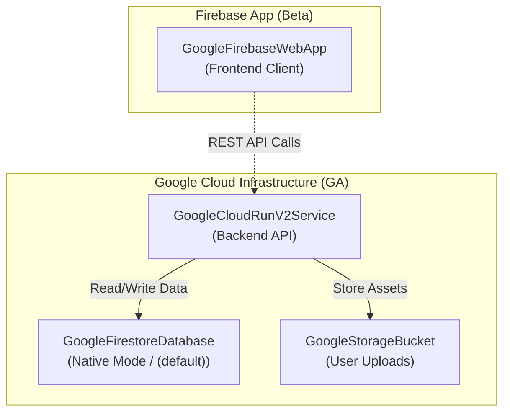

This guide matches the [README quickstart](https://github.com/nozomi-koborinai/terradart#quickstart) for the **0.25.x** line. TerraDart is **alpha** — breaking changes land only on **minor** bumps; see [Status & versioning](/docs/status/) for the change policy and the [path to beta](/docs/status/#path-to-beta).

## Prerequisites

- Dart SDK ≥ 3.6
- Terraform CLI ≥ 1.11.0
- Credentials for your target provider (e.g. Google Cloud Application Default Credentials `gcloud auth application-default login`, or provider environment variables)

## 1. Add dependencies

Choose `terradart_core` along with the provider factory package(s) your stack requires:

```yaml
# pubspec.yaml
dependencies:
  terradart_core: ^0.25.x
  terradart_google: ^0.25.x # for Google Cloud (GA)
  # terradart_google_beta: ^0.25.x # for Google Cloud beta-only resources
  # terradart_appwrite: ^0.25.x    # for Appwrite
  # terradart_cloudflare: ^0.25.x  # for Cloudflare edge infrastructure
```

Check [pub.dev](https://pub.dev/packages/terradart_core) for the latest patch, then run:

```bash
dart pub get
```

The GA `hashicorp/google` catalog is filled. Beta-only types live in [`terradart_google_beta`](https://pub.dev/packages/terradart_google_beta) (128 resource factories). [`terradart_appwrite`](https://pub.dev/packages/terradart_appwrite) is filled at the current pin (38 resource factories + 24 data sources). [`terradart_cloudflare`](https://pub.dev/packages/terradart_cloudflare) is filled at `cloudflare/cloudflare` `5.23.0` (257 resource factories + 446 data sources).

## 2. Define a Stack

Create `lib/orders_stack.dart` (or follow the [pubsub quickstart](https://github.com/nozomi-koborinai/terradart/tree/main/examples/pubsub_quickstart)):

```dart
import 'package:terradart_core/terradart_core.dart';
import 'package:terradart_google/provider.dart';
import 'package:terradart_google/pubsub.dart';

final class OrdersStack extends Stack {
  OrdersStack({required String projectId})
      : super(providers: [GoogleProvider(project: projectId)]) {
    final topic = add(GooglePubsubTopic(
      localName: 'orders',
      name: TfArg.literal('orders-prod'),
    ));
    addExport('ORDERS_TOPIC_NAME', ResourceIdExport(topic.nameRef));
    setAppExportsOutputPath('lib/generated/orders_stack.app.dart');
  }
}
```

## 3. Synth Terraform JSON

From `bin/infra.dart`:

```dart
import 'package:my_pkg/orders_stack.dart';

Future<void> main() async {
  final stack = OrdersStack(projectId: 'YOUR-PROJECT-ID');
  await stack.writeTo('tf-out');
}
```

```bash
dart run bin/infra.dart
```

This writes `tf-out/main.tf.json` and, when exports are literal-resolvable, `lib/generated/orders_stack.app.dart`.

## 4. Plan and apply

```bash
cd tf-out
terraform init
terraform plan
terraform apply
```

Your existing remote state backend and modules stay unchanged — TerraDart only replaces HCL/JSON authoring.

## 5. The boundary (optional)

Import generated constants in app code instead of string literals:

```dart
import 'generated/orders_stack.app.dart';

bool acceptsTopic(String eventTopic) =>
    eventTopic == OrdersStackExports.ORDERS_TOPIC_NAME;
```

Rename `orders-prod` in the Stack without updating the subscriber and `dart analyze` fails. See [Architecture — AppExport](/docs/architecture/#appexport-the-iac--app-seam) and the runnable [pubsub quickstart](https://github.com/nozomi-koborinai/terradart/tree/main/examples/pubsub_quickstart) (`lib/subscriber_stub.dart`).

## 6. Composing GA and Beta providers (Firebase + Google Cloud)

You can seamlessly combine Google Cloud GA resources (`terradart_google`) with beta-only resources (`terradart_google_beta`, such as Firebase project configuration and Web App registration) in a single `Stack`:



```yaml
# pubspec.yaml
dependencies:
  terradart_core: ^0.25.x
  terradart_google: ^0.25.x
  terradart_google_beta: ^0.25.x
```

```dart
import 'package:terradart_core/terradart_core.dart';
// GA: Google Cloud backend infrastructure
import 'package:terradart_google/cloud_run.dart';
import 'package:terradart_google/firestore.dart';
import 'package:terradart_google/provider.dart';
import 'package:terradart_google/storage.dart';
// Beta: Firebase project and app registration
import 'package:terradart_google_beta/firebase.dart';
import 'package:terradart_google_beta/provider.dart';

final class MobileAppBackendStack extends Stack {
  MobileAppBackendStack({required String projectId})
      : super(
          providers: [
            GoogleProvider(project: projectId, region: 'asia-northeast1'),
            GoogleBetaProvider(project: projectId, region: 'asia-northeast1'),
          ],
        ) {
    // 1. [Beta] Enable Firebase on the project
    final fb = add(GoogleFirebaseProject(
      localName: 'firebase',
      project: TfArg.literal(projectId),
    ));

    // 2. [Beta] Register Firebase client app
    add(GoogleFirebaseWebApp(
      localName: 'web_client',
      displayName: TfArg.literal('Web Client'),
      project: TfArg.literal(projectId),
      dependsOn: [fb],
    ));

    // 3. [GA] Firestore Database (Native mode)
    final db = add(GoogleFirestoreDatabase(
      localName: 'db',
      name: TfArg.literal('(default)'),
      locationId: TfArg.literal('asia-northeast1'),
      type: TfArg.literal(FirestoreDatabaseType.firestoreNative),
      dependsOn: [fb],
    ));

    // 4. [GA] Cloud Storage for user uploads
    final uploadsBucket = add(GoogleStorageBucket(
      localName: 'uploads',
      name: TfArg.literal('$projectId-uploads'),
      location: TfArg.literal('ASIA-NORTHEAST1'),
      storageClass: TfArg.literal(BucketStorageClass.standard),
      uniformBucketLevelAccess: TfArg.literal(true),
    ));

    // 5. [GA] Cloud Run v2 backend service
    add(GoogleCloudRunV2Service(
      localName: 'api',
      name: TfArg.literal('api-server'),
      location: TfArg.literal('asia-northeast1'),
      template: CloudRunV2ServiceTemplate(
        containers: [
          CloudRunV2ServiceServiceContainer(
            name: TfArg.literal('server'),
            image: TfArg.literal(
              'us-docker.pkg.dev/cloudrun/container/hello',
            ),
            env: [
              CloudRunV2ServiceEnvVar(
                name: TfArg.literal('UPLOAD_BUCKET'),
                source: CloudRunV2ServiceEnvVarFromLiteral(
                  TfArg.ref(uploadsBucket.nameRef),
                ),
              ),
            ],
          ),
        ],
      ),
      dependsOn: [db],
    ));
  }
}
```

Wrappers from `terradart_google_beta` automatically attach `provider = "google-beta"` in the synthesized Terraform JSON. See the complete runnable recipe in [`cookbook/firebase-app-backend`](https://github.com/nozomi-koborinai/terradart/tree/main/cookbook/firebase-app-backend).

## Next steps

- [Why TerraDart](/docs/why-terradart/) — motivation and comparisons
- [Architecture](/docs/architecture/) — `synth()`, `writeTo()`, curated coverage
- [Coverage](/docs/coverage/) — every curated factory, its barrel, and runnable examples
- [Migrating](/docs/migrating/) — read before every minor bump
- [Status & versioning](/docs/status/) — alpha vs beta vs 1.0
- [Examples](https://github.com/nozomi-koborinai/terradart/tree/main/examples) and [cookbook](https://github.com/nozomi-koborinai/terradart/tree/main/cookbook) for fuller stacks
