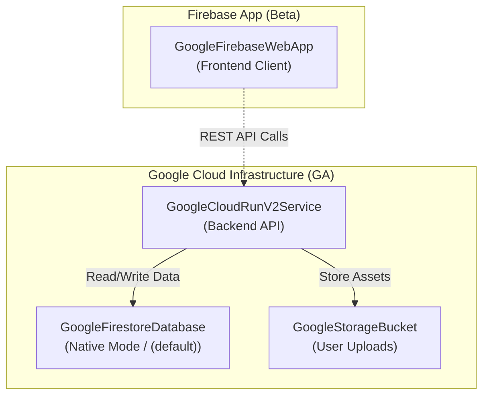

import { Tabs, TabItem } from '@astrojs/starlight/components';

This guide matches the [README quickstart](https://github.com/nozomi-koborinai/terradart#quickstart) for the **0.31.x** line. TerraDart is **alpha** — breaking changes land only on **minor** bumps; see [Status & versioning](/docs/status/) for the change policy and the [path to beta](/docs/status/#path-to-beta).

## Prerequisites

- Dart SDK ≥ 3.10
- Terraform CLI ≥ 1.11.0
- Credentials for your provider at apply time — Google Cloud Application Default Credentials (`gcloud auth application-default login`), the AWS SDK credential chain, `CLOUDFLARE_API_TOKEN`, or `APPWRITE_API_KEY`. Synth needs none, and none are written into the output.

## 1. Add dependencies

`terradart_core` plus the package for each provider your Stack uses (all on [pub.dev](https://pub.dev/packages/terradart_core)):

<Tabs syncKey="provider">
<TabItem label="Google Cloud">

```yaml
# pubspec.yaml
name: my_app
environment:
  sdk: ^3.10.0
dependencies:
  terradart_core: ^0.31.x
  terradart_google: ^0.31.x
  # terradart_google_beta: ^0.31.x  # beta-only types (Firebase, ...)
```

</TabItem>
<TabItem label="AWS">

```yaml
# pubspec.yaml
name: my_app
environment:
  sdk: ^3.10.0
dependencies:
  terradart_core: ^0.31.x
  terradart_aws: ^0.31.x
```

</TabItem>
<TabItem label="Cloudflare">

```yaml
# pubspec.yaml
name: my_app
environment:
  sdk: ^3.10.0
dependencies:
  terradart_core: ^0.31.x
  terradart_cloudflare: ^0.31.x
```

</TabItem>
<TabItem label="Appwrite">

```yaml
# pubspec.yaml
name: my_app
environment:
  sdk: ^3.10.0
dependencies:
  terradart_core: ^0.31.x
  terradart_appwrite: ^0.31.x
```

</TabItem>
</Tabs>

```bash
dart pub get
```

Each provider package wraps the whole catalog of its Terraform provider (Google's beta-only types live in [`terradart_google_beta`](https://pub.dev/packages/terradart_google_beta)), so any resource the provider documents has a factory. One Stack can mix packages.

## 2. Define a Stack

A Stack is one Terraform root module. `add` registers a resource; `addConstant` and `addOutput` declare what your app reads back — a constant at synth time, an output after apply — and `appExports` names the Dart file they are generated into:

<Tabs syncKey="provider">
<TabItem label="Google Cloud">

```dart
// lib/orders_stack.dart
import 'package:terradart_core/terradart_core.dart';
import 'package:terradart_google/provider.dart';
import 'package:terradart_google/pubsub.dart';

final class OrdersStack extends Stack {
  OrdersStack({required String projectId})
    : super(
        providers: [GoogleProvider(project: projectId)],
        appExports: AppExports('lib/generated/orders_stack.app.dart'),
      ) {
    final topic = add(GooglePubsubTopic(
      localName: 'orders',
      name: .literal('orders-prod'),
    ));
    addConstant('ordersTopicName', .ref(topic.nameRef));
    addOutput('orders_topic_id', .ref(topic.id));
  }
}
```

</TabItem>
<TabItem label="AWS">

```dart
// lib/queue_stack.dart
import 'package:terradart_aws/provider.dart';
import 'package:terradart_aws/sqs.dart';
import 'package:terradart_core/terradart_core.dart';

final class QueueStack extends Stack {
  QueueStack()
    : super(
        providers: [const AwsProvider(region: 'us-east-1')],
        appExports: AppExports('lib/generated/queue_stack.app.dart'),
      ) {
    final queue = add(AwsSqsQueue(
      localName: 'orders',
      name: .literal('orders-prod'),
    ));
    addConstant('ordersQueueName', .ref(queue.nameRef));
    addOutput('orders_queue_url', .ref(queue.url));
  }
}
```

More on AWS — Lambda, ECS Express Mode, S3 + CloudFront: [Dart apps on AWS](/docs/aws/).

</TabItem>
<TabItem label="Cloudflare">

```dart
// lib/edge_stack.dart
import 'package:terradart_cloudflare/dns.dart';
import 'package:terradart_cloudflare/provider.dart';
import 'package:terradart_cloudflare/zone.dart';
import 'package:terradart_core/terradart_core.dart';

final class EdgeStack extends Stack {
  EdgeStack({required String accountId})
    : super(
        providers: [const CloudflareProvider()],
        appExports: AppExports('lib/generated/edge_stack.app.dart'),
      ) {
    final zone = add(CloudflareZone(
      localName: 'main',
      name: .literal('example.com'),
      account: ZoneAccount(id: .literal(accountId)),
    ));
    final api = add(CloudflareDnsRecord(
      localName: 'api',
      zoneId: zone.ref, // only a CloudflareZone fits here
      name: .literal('api.example.com'),
      type: .literal(.cname),
      ttl: .literal(1),
      content: .content(.literal('ghs.googlehosted.com')),
      proxied: .literal(true),
    ));
    addConstant('apiHost', .ref(api.nameRef));
    addOutput('zone_id', .ref(zone.id));
  }
}
```

Runnable: [`examples/cloudflare_dns_quickstart`](https://github.com/nozomi-koborinai/terradart/tree/main/examples/cloudflare_dns_quickstart).

</TabItem>
<TabItem label="Appwrite">

```dart
// lib/uploads_stack.dart
import 'package:terradart_appwrite/provider.dart';
import 'package:terradart_appwrite/storage.dart';
import 'package:terradart_core/terradart_core.dart';

final class UploadsStack extends Stack {
  UploadsStack()
    : super(
        providers: [
          const AppwriteProvider(
            endpoint: 'https://cloud.appwrite.io/v1',
            projectId: 'my-project',
          ),
        ],
        appExports: AppExports('lib/generated/uploads_stack.app.dart'),
      ) {
    final uploads = add(AppwriteStorageBucket(
      localName: 'uploads',
      name: .literal('uploads'),
      fileSecurity: .literal(true),
    ));
    addOutput('uploads_bucket_id', .ref(uploads.id));
  }
}
```

Runnable: [`examples/appwrite_quickstart`](https://github.com/nozomi-koborinai/terradart/tree/main/examples/appwrite_quickstart), which covers every Appwrite factory.

</TabItem>
</Tabs>

`.literal(...)` is a value known now; `.ref(...)` is one Terraform resolves during apply. An argument that names another resource takes that resource's `ref` (`zoneId: zone.ref`) and does not compile with the wrong kind. Both are Dart 3.10 dot shorthands, like the enum in `.literal(.cname)` — every argument is typed, so the type name can be left out.

## 3. Synth Terraform JSON

There is no synth CLI: `bin/infra.dart` constructs the Stack and writes it. The rest of this guide follows the Google Cloud Stack; for the others, construct `QueueStack()`, `EdgeStack(accountId: ...)` or `UploadsStack()` the same way.

```dart
// bin/infra.dart
import 'package:my_app/orders_stack.dart';

Future<void> main() async {
  final stack = OrdersStack(projectId: 'YOUR-PROJECT-ID');
  await stack.writeTo('tf-out');
}
```

```bash
dart run bin/infra.dart
```

This writes `tf-out/main.tf.json` (with the `orders_topic_id` output) and `lib/generated/orders_stack.app.dart` (with the `ordersTopicName` constant and the `OrdersStackOutputs` reader).

## 4. Plan and apply

```bash
cd tf-out
terraform init
terraform plan
terraform apply
```

Your existing remote state backend and modules stay unchanged — TerraDart only replaces HCL/JSON authoring.

## 5. Read it from your app

App code imports the generated file instead of repeating strings:

```dart
// lib/subscriber.dart
import 'dart:io';

import 'generated/orders_stack.app.dart';

bool acceptsTopic(String eventTopic) =>
    eventTopic == OrdersStackConstants.ordersTopicName;

/// Known only after apply, so it comes from the generated outputs reader.
String ordersTopicId() =>
    OrdersStackOutputs.fromEnvironment(Platform.environment).ordersTopicId;
```

A deployed service reads outputs from its environment (`ORDERS_TOPIC_ID`) — the Stack passes them with `outputEnvironment()` — and a script can read `terraform output -json` with `OrdersStackOutputs.fromTerraformJson`.

Rename `orders-prod` in the Stack and the subscriber follows on the next synth — there is no second copy of the string to update. Rename or remove the constant and `dart analyze` fails. See [Architecture — outputs and constants](/docs/architecture/#outputs-and-constants-the-iac--application-seam) and the runnable [pubsub quickstart](https://github.com/nozomi-koborinai/terradart/tree/main/examples/pubsub_quickstart) (`lib/subscriber_stub.dart`).

## 6. Composing GA and Beta providers (Firebase + Google Cloud)

You can seamlessly combine Google Cloud GA resources (`terradart_google`) with beta-only resources (`terradart_google_beta`, such as Firebase project configuration and Web App registration) in a single `Stack`:



```yaml
# pubspec.yaml
dependencies:
  terradart_core: ^0.31.x
  terradart_google: ^0.31.x
  terradart_google_beta: ^0.31.x
```

```dart
import 'package:terradart_core/terradart_core.dart';
// GA: Google Cloud backend infrastructure
import 'package:terradart_google/cloud_run.dart';
import 'package:terradart_google/firestore.dart';
import 'package:terradart_google/provider.dart';
import 'package:terradart_google/storage.dart';
// Beta: Firebase project and app registration
import 'package:terradart_google_beta/firebase.dart';
import 'package:terradart_google_beta/provider.dart';

final class MobileAppBackendStack extends Stack {
  MobileAppBackendStack({required String projectId})
      : super(
          providers: [
            GoogleProvider(project: projectId, region: 'asia-northeast1'),
            GoogleBetaProvider(project: projectId, region: 'asia-northeast1'),
          ],
        ) {
    // 1. [Beta] Enable Firebase on the project
    final fb = add(GoogleFirebaseProject(
      localName: 'firebase',
      project: .literal(projectId),
    ));

    // 2. [Beta] Register Firebase client app
    add(GoogleFirebaseWebApp(
      localName: 'web_client',
      displayName: .literal('Web Client'),
      project: .literal(projectId),
      dependsOn: [ResourceDependency(fb)],
    ));

    // 3. [GA] Firestore Database (Native mode)
    final db = add(GoogleFirestoreDatabase(
      localName: 'db',
      name: .literal('(default)'),
      locationId: .literal('asia-northeast1'),
      type: .literal(.firestoreNative),
      dependsOn: [ResourceDependency(fb)],
    ));

    // 4. [GA] Cloud Storage for user uploads
    final uploadsBucket = add(GoogleStorageBucket(
      localName: 'uploads',
      name: .literal('$projectId-uploads'),
      location: .literal('ASIA-NORTHEAST1'),
      storageClass: .literal(.standard),
      uniformBucketLevelAccess: .literal(true),
    ));

    // 5. [GA] Cloud Run v2 backend service
    add(GoogleCloudRunV2Service(
      localName: 'api',
      name: .literal('api-server'),
      location: .literal('asia-northeast1'),
      template: CloudRunV2ServiceTemplate(
        containers: [
          CloudRunV2ServiceContainers(
            name: .literal('server'),
            image: .literal(
              'us-docker.pkg.dev/cloudrun/container/hello',
            ),
            env: [
              CloudRunV2ServiceEnv(
                name: .literal('UPLOAD_BUCKET'),
                source: .value(.ref(uploadsBucket.nameRef)),
              ),
            ],
          ),
        ],
      ),
      dependsOn: [ResourceDependency(db)],
    ));
  }
}
```

Wrappers from `terradart_google_beta` automatically attach `provider = "google-beta"` in the synthesized Terraform JSON. See the complete runnable recipe in [`cookbook/firebase-app-backend`](https://github.com/nozomi-koborinai/terradart/tree/main/cookbook/firebase-app-backend).

Every factory also takes a `provider:` parameter — Terraform's `provider` meta-argument. Register a second configuration of a provider with `alias:` and select it per resource; everything else keeps using the default configuration:

```dart
final class MultiRegionStack extends Stack {
  MultiRegionStack({required String projectId})
      : super(providers: [
          GoogleProvider(project: projectId, region: 'asia-northeast1'),
          GoogleProvider(alias: 'eu', project: projectId, region: 'europe-west1'),
        ]) {
    add(GoogleStorageBucket(
      localName: 'assets_eu',
      name: .literal('my-app-assets-eu'),
      location: .literal('EUROPE-WEST1'),
      provider: 'google.eu', // provider = google.eu
    ));
  }
}
```

Synth emits `provider.google` as a list when a name has more than one configuration, and rejects a `provider:` that matches no registered configuration. `provider: 'google-beta'` on a GA-catalog factory puts that one resource on the beta provider.

## Next steps

- [Why TerraDart](/docs/why-terradart/) — motivation and comparisons
- [Architecture](/docs/architecture/) — `synth()`, `writeTo()`, curated coverage
- [Coverage](/docs/coverage/) — every Google factory, its barrel, and runnable examples
- [Dart apps on AWS](/docs/aws/) — Lambda, ECS Express Mode, S3 + CloudFront
- [Migrating from HCL](/docs/migrate-from-hcl/) — bring an existing Terraform tree over
- [Migrating](/docs/migrating/) — read before every minor bump
- [Status & versioning](/docs/status/) — alpha vs beta vs 1.0
- [Examples](https://github.com/nozomi-koborinai/terradart/tree/main/examples) and [cookbook](https://github.com/nozomi-koborinai/terradart/tree/main/cookbook) for fuller stacks
