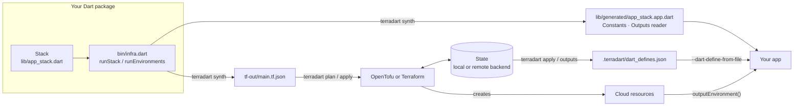
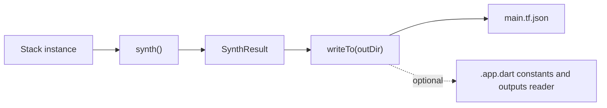
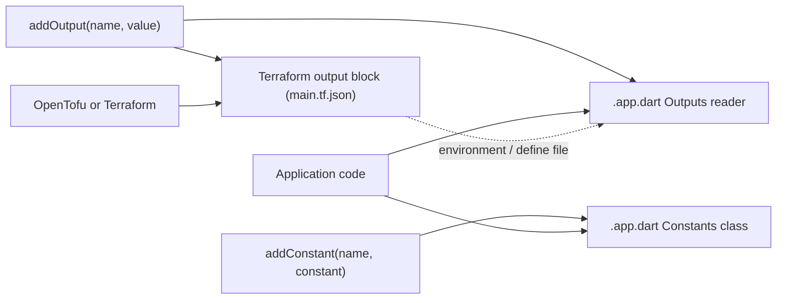

TerraDart is an authoring layer over Terraform. You describe infrastructure as a Dart `Stack`; TerraDart turns it into standard Terraform JSON, and OpenTofu or Terraform plan and apply it exactly as they would hand-written configuration. Dart gives you types, refactoring and `dart analyze`; state, planning and apply stay with the engine.

The same synth also writes a Dart file your app imports, so the values that cross from infrastructure to app — a topic name, a service URL — are typed and never copied by hand.

## The loop



1. **Author.** A `final class AppStack extends Stack` adds resources built with the factories of the provider packages — `terradart_google`, `terradart_aws`, `terradart_cloudflare`, `terradart_appwrite` — and declares the values the app reads back with `addConstant` and `addOutput`.
2. **Synth.** `terradart synth` runs `bin/infra.dart`, whose `runStack` (or `runEnvironments`, for [several environments](/docs/environments/)) builds the Stack and writes `tf-out/main.tf.json` plus the generated app file. `dart run bin/infra.dart` does the same without the command.
3. **Plan and apply.** `terradart plan` and `terradart apply` synthesize, then run `init` and `plan` or `apply` in `tf-out/` with a checksum-verified OpenTofu the command downloads, or the `tofu` or `terraform` already on your `PATH` — you never install Terraform yourself. State lives in the backend the Stack declares.
4. **Hand off.** Constants are known at synth and compiled into the app. Outputs exist after apply and reach the app through the generated reader: a deployed service from its environment, a Flutter or web client from the define file `terradart apply` writes, a script from the same file.

The [`terradart` command](/docs/cli/) runs steps 2 to 4 in one go.

## Synth

**Synth** is the in-memory step: the Stack is walked and assembled into the Terraform JSON tree. In code, `stack.synth()` returns a `SynthResult`, and `stack.writeTo(outDir)` writes it. `runStack` calls `writeTo('tf-out')` and tells the `terradart` command what it wrote. The [landing page](/) says you **generate** `*.tf.json`; this is the same step.



`synth()` is pure. It walks the resources you registered with `add(...)`, applies lifecycle wiring, dedups, and produces a `SynthResult` whose `tfJson` field carries the Terraform JSON tree.

`writeTo(outDir)` is the file-I/O wrapper. It always writes `main.tf.json`. When the Stack was constructed with `appExports: AppExports('lib/generated/<stack>.app.dart')`, it also writes that generated Dart file, rewritten in full on every synth. Synth runs before any write, so a Stack that cannot synthesize throws with nothing written — the failure mode is atomic, never partial.

### Synth issues

Before it encodes anything, synth checks the whole Stack and collects every problem it finds into one `SynthException`, so a broken Stack reports all of its issues in one run instead of one per fix. Each problem is a subtype of the sealed `SynthIssue`, carrying the address of the block that holds it and a message that says how to fix it:

| Issue | When |
|-------|------|
| `NoProviders` / `MissingProvider` / `ProviderConflict` | no provider is registered, a block needs one that is not, or two registrations clash (a repeated alias, different version pins for one name) |
| `UndeclaredVariable` | a `.variable('x')` or `var.x` names a variable neither `variable` nor `externalVariable` declared |
| `UnregisteredReference` | a block reads (or `depends_on`) a resource, data source or module that was built but never passed to `add` / `addModule` |
| `SensitiveLiteral` | a sensitive field is set to a literal, which would write the secret into `main.tf.json` |
| `InvalidTimeout` | a `TfTimeouts` value is not a Go duration string |
| `InvalidMoveTarget` | an `addMoved` target names no resource of the Stack |
| `UnresolvableConstant` | an `addConstant(...)` attribute has no literal value at synth |

`stack.validate()` returns the same list without throwing — the shape a test or a pre-commit check wants. The sealed hierarchy lets a `switch` handle the issues it cares about:

```dart
// lib/explain_stack.dart
import 'package:terradart_core/terradart_core.dart';

/// Prints why [stack] cannot synthesize, or nothing when it can.
void explain(Stack stack) {
  for (final issue in stack.validate()) {
    switch (issue) {
      case UnregisteredReference(:final address, :final target):
        print('$address reads $target, which was never added');
      case SensitiveLiteral(:final address, :final field):
        print('$address would write the secret $field into main.tf.json');
      default:
        print(issue);
    }
  }
}
```

A block declared in a hand-written `.tf` file beside `main.tf.json` is the one legitimate unregistered reference: declare it with `addExternalBlock('google_pubsub_topic.legacy')`, the counterpart of `externalVariable` for variables (`terradart migrate` does this for the blocks it leaves in the sidecar). Names are checked earlier, where they are registered: `add`, `addModule`, `variable` and `addOutput` throw `ArgumentError` for a name that is not a Terraform identifier.

`Stack`, `Resource`, and `Data` are `abstract base class`. Your subclasses must declare a class modifier:

```dart
final class AppInfraStack extends Stack {
  AppInfraStack() : super(providers: [GoogleProvider(project: 'my-project')]);
}
```

`base` and `sealed` are also valid; what is rejected is plain `class` (or `implements Stack`, which would bypass the base-class state that synth depends on).

## Plan, apply and state

TerraDart never reads or writes state itself. The Stack declares where state lives — `LocalBackend`, `GcsBackend`, `S3Backend`, or a partial backend completed per environment — and the engine keeps it there. The `terradart` command picks the engine: the one named in `pubspec.yaml` or on the command line, the one that last applied this state, `tofu` or `terraform` on `PATH`, or a pinned OpenTofu release it downloads and checks against its SHA-256 ([The engine](/docs/cli/#the-engine)).

Because the output is standard Terraform JSON, everything around the engine stays as it is: remote state, `-target`, `moved` blocks (`addMoved`), existing modules called with `addModule`, and HCL files beside `main.tf.json` that feed the same apply. With [environments](/docs/environments/), each one gets its own Terraform directory and state, selected with `--env`.

## The app boundary: constants and outputs

A Stack hands values to the Dart code that uses its resources — a Cloud Run service, a Lambda function, a Flutter client — in two ways, each with its own method:



- **`addOutput`** declares a Terraform `output` for a value known after apply — a resource ID, a Cloud Run URL — and a getter of the generated reader (see below). It takes any `TfArg`, so the value is a dot shorthand like every resource argument: `addOutput('service_url', service.uri, description: 'Cloud Run URL')`. It checks at registration that the name is a Terraform identifier, is not taken, and — unless `sensitive: true` — that the value does not read a sensitive field.
- **`addConstant`** declares a `static const` on the generated `<StackName>Constants` class, for a value known at synth. The value is a sealed `AppConstant<T>`, picked with a dot shorthand:
  - `topic.name` — the literal an attribute of the Stack is set to (`name: .literal('orders-prod')`), so the string is written once. Every input has such a getter, named `<input>Ref` (`scope.scopeId` for `scope_id`), and other resources can take it too (`scopeId: scope.scopeId`). Synth reports an `UnresolvableConstant` issue that says what the attribute is set by when it is not a literal (a reference, a variable, an expression, or left for the provider to compute) or is a sensitive field.
  - `.value(5)` — a value that belongs to no resource, such as an API version.
  - `.fromEnvironment('API_BASE_URL')` — a `String.fromEnvironment` read at the app's compile time.

  `T` can be `String`, `int`, `double`, `num`, `bool`, `Object`, or a `List` / `String`-keyed `Map` of them, each optionally nullable; `addConstant` rejects any other type, a name that is not a public Dart identifier, and a duplicate.

The constants file is configured once, on the constructor, and `addConstant` throws when it is missing:

```dart
// lib/orders_stack.dart
import 'package:terradart_google/provider.dart';
import 'package:terradart_google/pubsub.dart';

final class OrdersStack extends Stack {
  OrdersStack({required String projectId})
    : super(
        providers: [GoogleProvider(project: projectId)],
        appExports: AppExports('lib/generated/orders_stack.app.dart'),
      ) {
    final topic = add(GooglePubsubTopic('orders', name: .literal('orders-prod')));
    addConstant('ordersTopicName', .ref(topic.name));
    addOutput('orders_topic_id', topic.id);
    addDartDefineOutput();
  }
}
```

`terradart synth` runs `bin/infra.dart`, which writes `tf-out/main.tf.json` and the generated file:

```dart
// bin/infra.dart
import 'package:my_app/orders_stack.dart';
import 'package:terradart_core/terradart_core.dart';

Future<void> main(List<String> args) =>
    runStack(args, () => OrdersStack(projectId: 'my-project'));
```

### Reading outputs in the app

The same file holds `<StackName>Outputs`, a typed reader of the Stack's outputs: one getter per non-sensitive output, named in lowerCamelCase and typed like the output's value (`addOutput('orders_topic_id', topic.id)` becomes `String get ordersTopicId`). Its `const` constructors pick the source — the environment (`fromEnvironment`), or the defines compiled into a client (`fromDartDefine()`, see [Outputs in client apps](/docs/client-outputs/)):

```dart
// lib/read_outputs.dart
import 'dart:convert';
import 'dart:io';

import 'generated/orders_stack.app.dart';

/// A script or test that runs after `terradart apply` or `terradart outputs`,
/// reading the define file they write.
String appliedTopicId() {
  final defines = File('.terradart/dart_defines.json').readAsStringSync();
  final values = jsonDecode(defines) as Map<String, Object?>;
  return OrdersStackOutputs.fromEnvironment(
    values.cast<String, String>(),
  ).ordersTopicId;
}

/// A deployed service, whose environment carries ORDERS_TOPIC_ID.
String deployedTopicId() =>
    OrdersStackOutputs.fromEnvironment(Platform.environment).ordersTopicId;
```

`fromEnvironment` and `fromDartDefine` read each output from the variable named after it in SCREAMING_SNAKE_CASE (`ORDERS_TOPIC_ID`); a `String` output is the variable's value and any other type is JSON. Each getter reads when called, so a service whose environment sets only some of the variables can read those, and a missing or mistyped value throws a `StateError` naming the output and the variable. A sensitive output has no getter — read a secret from its secret store. With `appExports` set, `addOutput` rejects an output whose getter is not a usable Dart identifier, or whose getter or variable another output already has.

### Passing outputs to a service

`outputEnvironment()` returns exactly those variables — each non-sensitive output registered so far, as a `(name, value)` record of the variable name and a `TfArg<String>`: a `String` output as is, any other as `jsonencode(...)` — so a Cloud Run service (or a function) receives the outputs it reads, with no variable name written twice:

```dart
final topic = add(GooglePubsubTopic('orders', name: .literal('orders-prod')));
addOutput('orders_topic_id', topic.id);
final service = add(GoogleCloudRunV2Service(
  'api',
  name: .literal('orders-api'),
  location: .literal('asia-northeast1'),
  template: CloudRunV2ServiceTemplate(containers: [
    .new(
      image: .literal('us-docker.pkg.dev/cloudrun/container/hello'),
      env: [
        for (final (:name, :value) in outputEnvironment())
          .new(name: .literal(name), source: .value(value)),
      ],
    ),
  ]),
));
addOutput('service_uri', service.uri); // after: a service cannot read itself
```

Where a provider takes the environment as one map — an AWS Lambda function, a Cloud Function — pass `variables`, the same environment as a `TfArg<Map<String, String>>`:

```dart
final table = add(AwsDynamodbTable(
  'items',
  name: .literal('items'),
  hashKey: .literal('id'),
  attribute: [.new(name: .literal('id'), type: .s)],
));
addOutput('table_name', table.name);
add(AwsLambdaFunction(
  'api',
  functionName: .literal('items-api'),
  role: .literal('arn:aws:iam::123456789012:role/items-api'),
  runtime: .providedAl2023,
  handler: .literal('bootstrap'),
  code: .filename(.literal('build/bootstrap.zip')),
  environment: .new(variables: outputEnvironment().variables),
));
```

`outputEnvironment(only: [...])` picks outputs by name. Register an output that reads the service itself after the call — a resource whose environment references its own attributes is a Terraform cycle.

### Building a client with them

A client app — Flutter, Dart web, a CLI — gets the same variables as a file instead. `addDartDefineOutput()` declares an output whose value is the JSON that `--dart-define-from-file` reads; `terradart apply` writes it to `.terradart/dart_defines.json` (`.terradart/dart_defines.<env>.json` with `--env`), and the client reads it with `const OrdersStackOutputs.fromDartDefine()`. [Outputs in client apps](/docs/client-outputs/) walks through it.

`AppExports(path, name: 'Orders')` renames the generated classes (`OrdersConstants`, `OrdersOutputs`). The path is relative to the directory `bin/infra.dart` runs in, and the generated file imports only `dart:convert`, so it can live in a small package the app and the infra package both depend on, keeping the app free of provider packages — the [Lunch Concierge recipe](https://github.com/nozomi-koborinai/terradart/tree/main/cookbook/lunch-concierge) writes it into its `shared/` package. Runnable pattern: [pubsub quickstart](https://github.com/nozomi-koborinai/terradart/tree/main/examples/pubsub_quickstart) (`lib/subscriber_stub.dart`).

A worked end-to-end example lives in the [cookbook `single-project-app` recipe](https://github.com/nozomi-koborinai/terradart/tree/main/cookbook/single-project-app): the outputs `db_instance` and `db_name` passed to the Cloud Run service with `outputEnvironment()`, the Terraform output `coffee_service_uri`, and the constants `serviceName` and `region` read from the Cloud Run service's own `name` and `location`.

## Provider packages

Each provider package wraps one official Terraform provider, and its factories mirror that provider's schema — one per resource and data source, with typed arguments, enums, nested blocks and references:

- **[`terradart_google`](https://pub.dev/packages/terradart_google)** — the GA HashiCorp [`google`](https://registry.terraform.io/providers/hashicorp/google/latest) provider catalog, every type on [Google Cloud coverage](/docs/coverage/google/).
- **[`terradart_google_beta`](https://pub.dev/packages/terradart_google_beta)** — the types only `hashicorp/google-beta` has; types GA also has stay in `terradart_google`.
- **[`terradart_aws`](https://pub.dev/packages/terradart_aws)** — HashiCorp [`aws`](https://registry.terraform.io/providers/hashicorp/aws/latest), filled at its pinned release.
- **[`terradart_cloudflare`](https://pub.dev/packages/terradart_cloudflare)** — the official `cloudflare/cloudflare` provider, filled at its pinned release.
- **[`terradart_appwrite`](https://pub.dev/packages/terradart_appwrite)** — the official `appwrite/appwrite` provider, filled at its pinned release.

**[`terradart_time`](https://pub.dev/packages/terradart_time)** is a small hand-written package beside them: `TimeProvider` / `TimeSleep` for HashiCorp [`time`](https://registry.terraform.io/providers/hashicorp/time/latest), usable from a Stack on any provider. One Stack can mix packages.

Each provider has a page under Providers — [Google Cloud](/docs/providers/google/), [AWS](/docs/providers/aws/), [Cloudflare](/docs/providers/cloudflare/), [Appwrite](/docs/providers/appwrite/) — and [How TerraDart is built](/docs/how-its-built/) covers how the factories are generated from the provider schemas and kept current.

## Non-goals

- Not a Terraform replacement — state and apply stay in OpenTofu or Terraform.
- Not a multi-cloud abstraction layer — wrappers faithfully mirror provider schemas rather than imposing cross-cloud abstractions.
- Not a constructs framework in the pre-1.0 cycle.
- Not a module system — `addModule(ModuleCall(...))` calls an existing Terraform module by its `source`, and HCL files beside the generated `*.tf.json` feed the same apply; TerraDart does not turn modules into Dart.

See [README — Non-goals](https://github.com/nozomi-koborinai/terradart#non-goals) for the canonical list.

## Further reading

- [The terradart command](/docs/cli/) — every command, the entry point, the engine.
- [Environments](/docs/environments/) — one Stack per environment, each with its own state and define file.
- [Outputs in client apps](/docs/client-outputs/) — the define file and the reader, step 4 in depth.
- [How TerraDart is built](/docs/how-its-built/) — the generation pipeline and verification harness behind the factories.
- [`terradart_core` on pub.dev](https://pub.dev/packages/terradart_core) — the `Stack`, `TfArg` and `AppConstant` API reference.
- [`examples/` on GitHub](https://github.com/nozomi-koborinai/terradart/tree/main/examples) — runnable quickstart Stacks.
