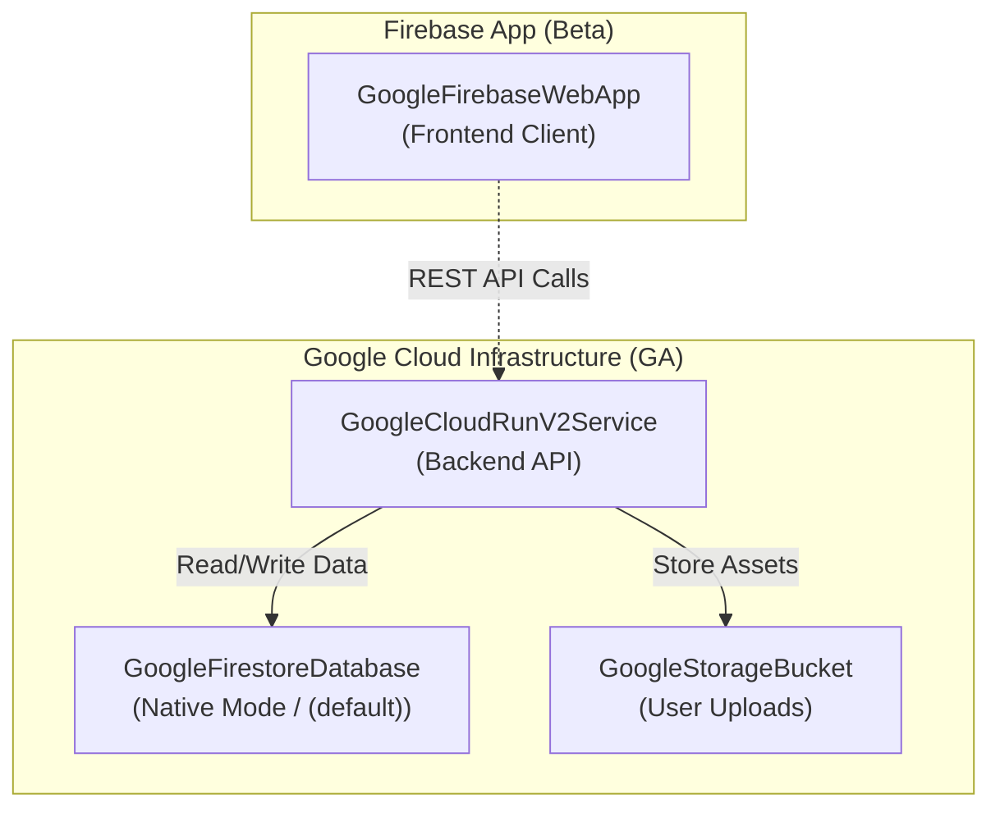

[`terradart_google`](https://pub.dev/packages/terradart_google) wraps the whole GA `hashicorp/google` catalog — every resource and data source — and [`terradart_google_beta`](https://pub.dev/packages/terradart_google_beta) adds the types that exist only in `hashicorp/google-beta` (Firebase app registration, preview services). A type that is also in GA stays in `terradart_google`. Both are generated from the provider schema and the Magic Modules definitions Google publishes, so enums, exactly-one-of groups and resource references carry over as Dart types.

## Install

```yaml
# pubspec.yaml
dependencies:
  terradart_core: ^0.31.x
  terradart_google: ^0.31.x
  terradart_google_beta: ^0.31.x # only for beta-only types
```

Apply authenticates with Application Default Credentials (`gcloud auth application-default login`) or a service account in CI; synth needs no credentials.

## Imports

Each Google service is its own barrel, so IDE completion stays scoped to what a file uses: `package:terradart_google/cloud_run.dart`, `pubsub.dart`, `bigquery.dart`, `compute.dart`, and so on, plus `provider.dart` for `GoogleProvider`. The [Google Cloud coverage](/docs/coverage/google/) page lists every factory with its barrel and a runnable example. `package:terradart_google/terradart_google.dart` still re-exports everything.

## Enabling APIs

A fresh project has most APIs off. `Apis.enable` registers a `google_project_service` for every API the factories of the given barrels need, plus a propagation wait (`TimeSleep` from [`terradart_time`](https://pub.dev/packages/terradart_time)) that resources depend on:

```dart
// lib/events_stack.dart
import 'package:terradart_core/terradart_core.dart';
import 'package:terradart_google/project.dart';
import 'package:terradart_google/provider.dart';
import 'package:terradart_google/pubsub.dart';
import 'package:terradart_time/terradart_time.dart';

final class EventsStack extends Stack {
  EventsStack({required String projectId})
    : super(providers: [GoogleProvider(project: projectId), const TimeProvider()]) {
    final apis = Apis.enable(this, barrels: [Barrels.pubsub]);
    add(GooglePubsubTopic(
      localName: 'events',
      name: .literal('events'),
      dependsOn: apis,
    ));
  }
}
```

## IAM grants

An IAM adjunct takes its parent as a reference (`bucket: uploads.ref`) and who the grant is for as an `IamPrincipal`. A service account, a service agent or a default service account data source hands out its own as `principal`; anyone else takes the constructor of their kind: `.user(email)`, `.group(email)`, `.serviceAccount(email)`, `.domain(domain)`, `.allUsers`, `.allAuthenticatedUsers`, or `.principalSet(pool, attribute)` for Workload Identity Federation.

```dart
final runtime = add(
  GoogleServiceAccount(localName: 'runtime', accountId: .literal('runtime')),
);
final uploads = add(
  GoogleStorageBucket(
    localName: 'uploads',
    name: .literal('uploads'),
    location: .literal('US'),
  ),
);
add(
  GoogleStorageBucketIamMember(
    localName: 'runtime_writer',
    bucket: uploads.ref,
    role: .literal('roles/storage.objectCreator'),
    member: runtime.principal,
  ),
);
add(
  GoogleStorageBucketIamBinding(
    localName: 'admins',
    bucket: uploads.ref,
    role: .literal('roles/storage.admin'),
    members: .literal([.group('sre@example.com'), .user('alice@example.com')]),
  ),
);
```

## GA and beta in one Stack (Firebase + Google Cloud)

You can seamlessly combine Google Cloud GA resources (`terradart_google`) with beta-only resources (`terradart_google_beta`, such as Firebase project configuration and Web App registration) in a single `Stack`:



```yaml
# pubspec.yaml
dependencies:
  terradart_core: ^0.31.x
  terradart_google: ^0.31.x
  terradart_google_beta: ^0.31.x
```

```dart
import 'package:terradart_core/terradart_core.dart';
// GA: Google Cloud backend infrastructure
import 'package:terradart_google/cloud_run.dart';
import 'package:terradart_google/firestore.dart';
import 'package:terradart_google/provider.dart';
import 'package:terradart_google/storage.dart';
// Beta: Firebase project and app registration
import 'package:terradart_google_beta/firebase.dart';
import 'package:terradart_google_beta/provider.dart';

final class MobileAppBackendStack extends Stack {
  MobileAppBackendStack({required String projectId})
      : super(
          providers: [
            GoogleProvider(project: projectId, region: 'asia-northeast1'),
            GoogleBetaProvider(project: projectId, region: 'asia-northeast1'),
          ],
        ) {
    // 1. [Beta] Enable Firebase on the project
    final fb = add(GoogleFirebaseProject(
      localName: 'firebase',
      project: .literal(projectId),
    ));

    // 2. [Beta] Register Firebase client app
    add(GoogleFirebaseWebApp(
      localName: 'web_client',
      displayName: .literal('Web Client'),
      project: .literal(projectId),
      dependsOn: [fb],
    ));

    // 3. [GA] Firestore Database (Native mode)
    final db = add(GoogleFirestoreDatabase(
      localName: 'db',
      name: .literal('(default)'),
      locationId: .literal('asia-northeast1'),
      type: .literal(.firestoreNative),
      dependsOn: [fb],
    ));

    // 4. [GA] Cloud Storage for user uploads
    final uploadsBucket = add(GoogleStorageBucket(
      localName: 'uploads',
      name: .literal('$projectId-uploads'),
      location: .literal('ASIA-NORTHEAST1'),
      storageClass: .literal(.standard),
      uniformBucketLevelAccess: .literal(true),
    ));

    // 5. [GA] Cloud Run v2 backend service
    add(GoogleCloudRunV2Service(
      localName: 'api',
      name: .literal('api-server'),
      location: .literal('asia-northeast1'),
      template: CloudRunV2ServiceTemplate(
        containers: [
          .new(
            name: .literal('server'),
            image: .literal(
              'us-docker.pkg.dev/cloudrun/container/hello',
            ),
            env: [
              .new(
                name: .literal('UPLOAD_BUCKET'),
                source: .value(uploadsBucket.name),
              ),
            ],
          ),
        ],
      ),
      dependsOn: [db],
    ));
  }
}
```

Wrappers from `terradart_google_beta` automatically attach `provider = "google-beta"` in the synthesized Terraform JSON. See the complete runnable recipe in [`cookbook/firebase-app-backend`](https://github.com/nozomi-koborinai/terradart/tree/main/cookbook/firebase-app-backend).

## Several provider configurations

Every factory also takes a `provider:` parameter — Terraform's `provider` meta-argument. Register a second configuration of a provider with `alias:` and select it per resource; everything else keeps using the default configuration:

```dart
final class MultiRegionStack extends Stack {
  MultiRegionStack({required String projectId})
      : super(providers: [
          GoogleProvider(project: projectId, region: 'asia-northeast1'),
          GoogleProvider(alias: 'eu', project: projectId, region: 'europe-west1'),
        ]) {
    add(GoogleStorageBucket(
      localName: 'assets_eu',
      name: .literal('my-app-assets-eu'),
      location: .literal('EUROPE-WEST1'),
      provider: 'google.eu', // provider = google.eu
    ));
  }
}
```

Synth emits `provider.google` as a list when a name has more than one configuration, and rejects a `provider:` that matches no registered configuration. `provider: 'google-beta'` on a GA-catalog factory puts that one resource on the beta provider.

## Examples

Every Google quickstart synthesizes and passes `terraform validate` in CI:

- **Foundational & IAM**: [Pub/Sub](https://github.com/nozomi-koborinai/terradart/tree/main/examples/pubsub_quickstart), [Cloud Tasks](https://github.com/nozomi-koborinai/terradart/tree/main/examples/cloud_tasks_quickstart), [Secret Manager](https://github.com/nozomi-koborinai/terradart/tree/main/examples/secret_manager_quickstart), [IAM](https://github.com/nozomi-koborinai/terradart/tree/main/examples/iam_quickstart)
- **Compute & Networking**: [Compute & Firewall](https://github.com/nozomi-koborinai/terradart/tree/main/examples/compute_quickstart), [GKE](https://github.com/nozomi-koborinai/terradart/tree/main/examples/gke_quickstart), [Cloud DNS](https://github.com/nozomi-koborinai/terradart/tree/main/examples/dns_quickstart)
- **Data & Storage**: [Cloud Storage](https://github.com/nozomi-koborinai/terradart/tree/main/examples/storage_quickstart), [BigQuery](https://github.com/nozomi-koborinai/terradart/tree/main/examples/bigquery_quickstart), [Cloud Bigtable](https://github.com/nozomi-koborinai/terradart/tree/main/examples/bigtable_quickstart), [KMS](https://github.com/nozomi-koborinai/terradart/tree/main/examples/kms_quickstart)
- **Application Platform**: [Cloud Run v2](https://github.com/nozomi-koborinai/terradart/tree/main/examples/cloud_run_quickstart), [Cloud Monitoring](https://github.com/nozomi-koborinai/terradart/tree/main/examples/monitoring_quickstart), [Workflows](https://github.com/nozomi-koborinai/terradart/tree/main/examples/workflows_quickstart), [Eventarc](https://github.com/nozomi-koborinai/terradart/tree/main/examples/eventarc_quickstart)
- **AI & Agents**: [Vertex AI](https://github.com/nozomi-koborinai/terradart/tree/main/examples/vertex_ai_quickstart), [Agentic Applications](https://github.com/nozomi-koborinai/terradart/tree/main/examples/agentic_applications_quickstart)

Full applications, infrastructure and app together, are in the [cookbook](https://github.com/nozomi-koborinai/terradart/tree/main/cookbook): `single-project-app` (Cloud Run + Cloud SQL), `firebase-app-backend`, `lunch-concierge`.

## Reference

- [Coverage](/docs/coverage/google/) — every Google factory, its barrel and its example
- [`terradart_google` API docs](https://pub.dev/documentation/terradart_google/latest/) and [`terradart_google_beta` API docs](https://pub.dev/documentation/terradart_google_beta/latest/)
